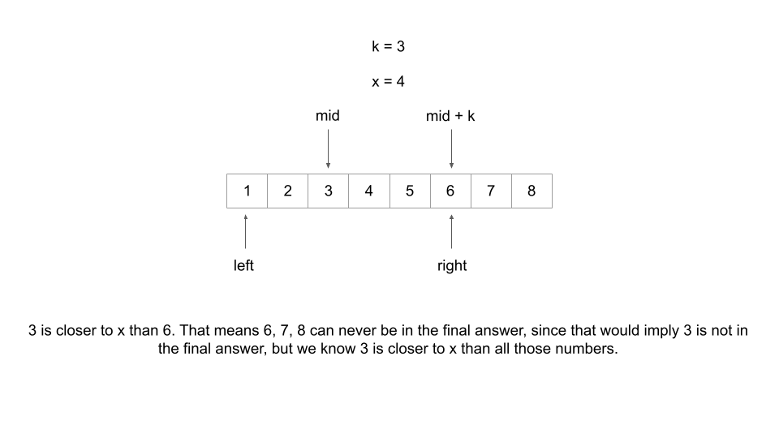
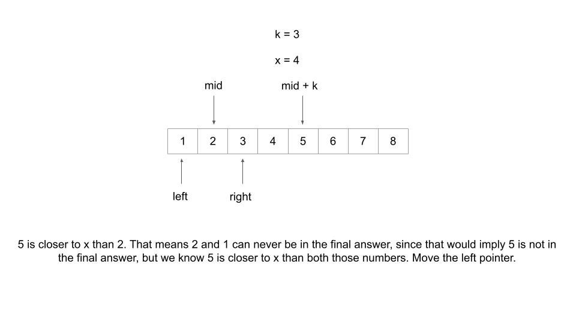
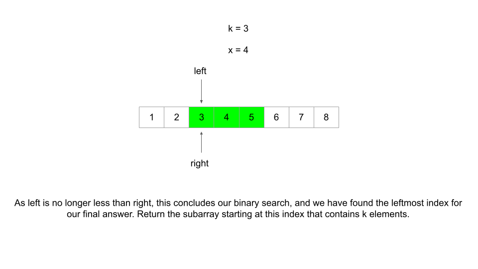

# 658 Find K Closest Elements

Given a **sorted** integer array `arr`, two integers `k` and `x`, return the `k` closest integers to `x` in the array. The result should also be sorted in ascending order.

An integer `a` is closer to `x` than an integer `b` if:

- `|a - x| < |b - x|`, or
- `|a - x| == |b - x|` and `a < b`

 

**Example 1:**

```
Input: arr = [1,2,3,4,5], k = 4, x = 3
Output: [1,2,3,4]
```

**Example 2:**

```
Input: arr = [1,2,3,4,5], k = 4, x = -1
Output: [1,2,3,4]
```


We can actually find the bounds of our sliding window much faster - and independent of `k`! First of all, what is the biggest index the left bound could be? If there needs to be `k` elements, then the left bound's upper limit is `arr.length-k`, because if it were any further to the right, you would run out of elements to include in the final answer. 

As demonstrated in Approach 2, binary search is typically used to find if an element exists or where an element belongs in a sorted array. The beauty of algorithms lies in how abstract they are - with some clever thinking, we can apply binary search in a unique way to move out `left` and `right` pointers closer and closer to the left bound of our answer.

Let's consider two indicates at each binary search operation, the usual `mid`, and some index `mid + k `. The relationship between these indicates is significant because only one of them could possibly be in a final answer. For example, if `mid = 2`, and `k = 3`, then `arr[2]` and `arr[5]` could not possibly both be in the answer, since that would require taking 4 elements `arr[2], arr[3], arr[4], arr[5]`. 

This leads us to the question: how do we move our pointer `left` and `right`? If the element at `arr[mid]` is closer to `x` than `arr[mid + k]`, then that means `arr[mid + k]`, as well as every element to the right of it can never be in the answer. This means we should move our `right` pointer to avoid considering them. The logic is the same vice-versa - if `arr[mid + k]` is closer to `x`, then move the left pointer.

 








Algorithm

1. Initalize two variables to perform binary search with, `left = 0 ` and `right = len(arr) -k`.
2. Perform a binary search. At each operation, calculate `mid = (left + right)/2` and compare the two elements located at `arr[mid]` and `arr[mid + k]` . If the element at `arr[mid]` is closer to `x`, then move the right pointer. If the element at `arr[mid + k]` is closer to `x`, **then move the left pointer. Remember, the smaller element always wins when there is a tie.**
3. At the end of the binary search, we have located the leftmost index for the final answer. Return the subarray starting at this index that contains `k` elements.

```java
class Solution {
    public List<Integer> findClosestElements(int[] arr, int k, int x) {
        int left = 0;
        int right = arr.length -k; // make sure from left to right at least have k numbsers

        while (left < right){
            int mid = left + (right - left)/2;
            if (x-arr[mid] > arr[mid+k] -x){
                left = mid+1;
            }else {
                right = mid;
            }
        }

        List<Integer> result = new ArrayList<Integer>();
        for (int i = left; i < left + k; i++){
            result.add(arr[i]);

        }

        return result;
        
    }
    //  0 1 2 3 4
    // [1,2,3,4,5]
    //  l       r
    //      
    //  l r              5-4 =1                            k = 4    x = 3
}   //. m=0
    //           4   m+k = 0+4 = 4
    //  r
    //  1      
    // 
```


 0 1 2 3 4 5 6 7 8

[1,1,2,2,2,2,2,3,3]              r = 9-3 = 6

  l				  r

​           m


```java
class Solution {
    public List<Integer> findClosestElements(int[] arr, int k, int x) {
        int left = 0;
        int right = arr.length -k; // make sure from left to right at least have k numbsers

        while (left < right){
            int mid = left + (right - left)/2;
            if (Math.abs(x-arr[mid]) > Math.abs(arr[mid+k] -x){  ❌ // Intuitionly I use Math.abs, but wrong.
                left = mid+1;
            }else {
                right = mid;
            }
        }

        List<Integer> result = new ArrayList<Integer>();
        for (int i = left; i < left + k; i++){
            result.add(arr[i]);

        }

        return result;
        
    }
    //  0 1 2 3 4
    // [1,2,3,4,5]
    //  l       r
    //      
    //  l r              5-4 =1                            k = 4    x = 3
}   //. m=0
    //           4   m+k = 0+4 = 4
    //  r
    //  1      
    // 
```

Explain:

The corner case that breaks `abs(x - arr[mid]) > abs(arr[mid+k]-x)` is when `arr[mid]` to `arr[mid + k]` are all the same and the numbers are smaller than `x` (If they're larger it's no problem). For example.

```csharp
[1,1,2,2,2,2,2,3,3]
3
3
```

==**In the first iteration, `mid` equals to 3 and `arr[3]` to `arr[3 + 3]` is [2, 2, 2, 2]. Because `abs(x - arr[mid]) == abs(arr[mid + k] -x)`, we will recursive into the left half, which is wrong.**==


Now let's see how `x-arr[mid] > arr[mid + k] - x` works:

There are 3 possible positions x can be relative to `arr[mid]` and `arr[mid + k]`. Say this array is sorted from small to large, [x1, arr[mid], x2, arr[mid+k],x3]

* Case x1:

  `x1` smaller than both `arr[mid]` and `arr[mid+k]`. We should recurse into the left.

  `x - arr[mid]` is negative and `arr[mid + k] - x` is positive.

  The condition is false and we recurse to left. With `abs()`, we also recurse to left.

* Case x2:

  `x2` is in between `arr[mid]` and `arr[mid + k]`. We should recurse to the side that is closer to `x`.

  `x - arr[mid]` and `arr[mid + k] - x` and both positive.

  The comparison works the same as using `abs()` ; we recursive to the closer side.

  (when in the case of `arr[mid] == arr[mid + k]`, the condition is false and we recurse to the left).

* Case x3:

  `x3` is larger than both `arr[mid]` and `arr[mid + k]` . We should recurse into the right.

  `x - arr[mid]` is positive and `arr[mid + k] - x` is negative.

  The condition is true and we recurse to right.

  Now the previously failed corner case `arr[mid] == arr[mid + k] < x3` doesn't cause a problem anymore because the sign of the numbers we're comparing is still the same.


```java
class Solution {
    public List<Integer> findClosestElements(int[] arr, int k, int x) {
        List<Integer> result = new ArrayList<Integer>();
        // left is the index of the largest smaller or equal element,
        // right = left + 1.
        // these two should be the closest to target
        int left = closest(arr, x);
        int right = left + 1;
        int count = 0;
        int leftres = left;

        // this is a typical merge operation.
        for (int i = 0; i < k; i++){
            // we can advance the left pointer when:
            // 1. right pointer is out of bound, left pointer is not out of
            // 2. right pointer is not out of bound, left pointer is not out of bound
            //    , and array[left] is closer to target.
            if (left < 0){
                right++;
            }else if (right >= arr.length){
                left--;
                count++;
            }else if (Math.abs(x - arr[left]) <= Math.abs(arr[right] - x)){
                left--;
                count++;
            }else{
                right++;
            }
        }

        leftres = leftres - count + 1;

        for (int i = 0; i < k; i++){
            result.add(arr[leftres]);
            leftres = leftres + 1;
        }

        return result;
    }

    public static int closest(int[] arr, int x){
        // find the largest smaller or equal elements' index in the array.
        int left = 0;
        int right = arr.length - 1;
        while (left < right -1){
            int mid = left + (right - left)/2;
            if (arr[mid] == x){
                left = mid;
            }else if (arr[mid] < x){
                left = mid;
            }else {
                right = mid;
            }
        }

        int result = -1;

        if (Math.abs(arr[left]-x) <= Math.abs(arr[right]-x)){
            result = left;
        }else{
            result = right;
        }
        return result;


    }
}
```


### 9 K Closest In Sorted Array (Lai)

Given a target integer T, a non-negative integer K and an integer array A sorted in ascending order, find the K closest numbers to T in A. If there is a tie, the smaller elements are always preferred.

**Assumptions**

- A is not null
- K is guranteed to be >= 0 and K is guranteed to be <= A.length

**Return**

- A size K integer array containing the K closest numbers(not indices) in A, sorted in ascending order by the difference between the number and T. 

**Examples**

- A = {1, 2, 3}, T = 2, K = 3, return {2, 1, 3} or {2, 3, 1}
- A = {1, 4, 6, 8}, T = 3, K = 3, return {4, 1, 6}


Given a target integer T, a non-negative integer K and an integer array A sorted in ascending order, find the K closest numbers to T in A.

1 3 5 9 11

T: 6, K = 4  -> 1, 3, 5, 9 or 3, 5, 9 11

T: 10, K = 3 -> 5, 9 , 11

1. Clarification 

   * corner case: null/ empty?
   * range of K ?
   * size? in memory
   * multiple solution? return any

2. Examples

3. Solution

   * a. Assumptions

     i. `k >= array.length` , return all, `k = 0`, return nothing.

     ii. order ? in any order

   * b. Input/output(signature)

     i. input: int[] array, int target, int k

     ii. output: int[] (index ? value)

   * c. Corner cases

     i. null: empty array

     ii. empty: empty array

     iii. k = 0, return empty array, k >= array.length, return initial array

   * d. Algorithm

     i. binary search to find the closest element + 中心开花(expend)

   * e. Time/space complexity

     i. time: O(logn + k)

     ii. space: O(1)

4. Coding

5. Test

   a. Test corner cases: null, empty 0, 1, 2 elements

   b. Test general cases


Step1: run a binary search until we have [L, R] two elements O(logn)

Step2: 谁小移谁				O(k)


```java
public class Solution {
  public int[] kClosest(int[] array, int target, int k) {
    // Write your solution here
    // base case 
    if (array == null || array.length == 0){
      return array;
    }

    int[] result = new int[k];
    int left = closet(array, target );
    int right = left + 1;
    for (int i = 0; i < k; i++){
      if (left < 0){ // can not =
        result[i] = array[right];
        right++;
      }else if (right > array.length - 1){ // can not =
        result[i] = array[left];
        left--;
      }else if (Math.abs(target - array[left]) <= Math.abs(array[right] - target)){
        result[i] = array[left];
        left--;
      }else{
        result[i] = array[right];
        right++;
      }
    }

    return result;
  }

  public static int closet(int[] array, int target){
    int left = 0;
    int right = array.length - 1;
    while (left < right - 1){
      int mid = left + (right - left)/2;
      if (array[mid] == target){
        left = mid;
      }else if (array[mid] < target){
        left = mid;
      }else {
        right = mid;
      }
    }

    if (Math.abs(array[left]- target)<= Math.abs(array[right] -target)){
      return left;
    }else{
      return right;
    }

  }
}

```


