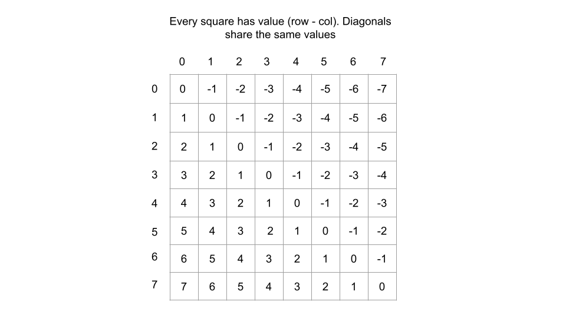
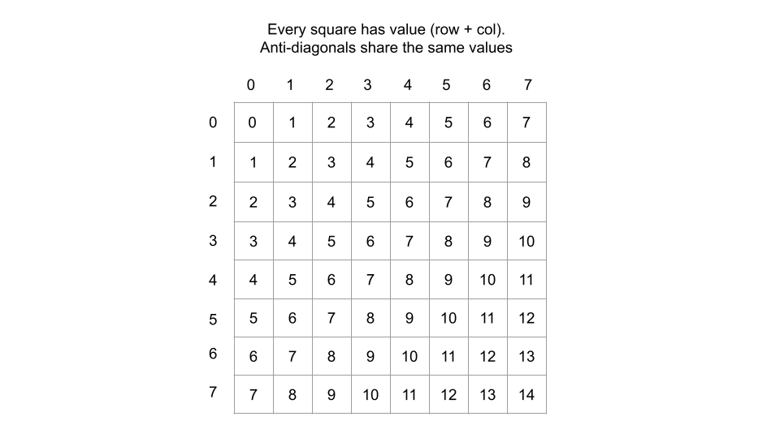

# 51 N queens

The **n-queens** puzzle is the problem of placing `n` queens on an `n x n` chessboard such that no two queens attack each other.

Given an integer `n`, return *all distinct solutions to the **n-queens puzzle***. You may return the answer in **any order**.

Each solution contains a distinct board configuration of the n-queens' placement, where `'Q'` and `'.'` both indicate a queen and an empty space, respectively.

**Example 1:**


```
Input: n = 4
Output: [[".Q..","...Q","Q...","..Q."],["..Q.","Q...","...Q",".Q.."]]
Explanation: There exist two distinct solutions to the 4-queens puzzle as shown above
```

**Example 2:**

```
Input: n = 1
Output: [["Q"]]
```


N = 4, there are two ways of putting 4 queens:

[1, 3, 0, 2] --> the Queen on the first row is at y index 1, the Queen on the second row is at y index 3, the Queen on the third row is at y index 0 and the Queen on the fourth row is at y index 2.

[2, 0, 3, 1] --> the Queen on the first row is at y index 2, the Queen on the second row is at y index 0, the Queen on the third row is at y index 3 and the Queen on the fourth row is at y index 1.

|      | 0     | 1     | 2      | 3     | 4     | 5     | 6     | 7     |
| ---- | ----- | ----- | ------ | ----- | ----- | ----- | ----- | ----- |
| 0    |       | Q0    | ==\|== |       |       |       | ==/== |       |
| 1    |       |       | ==\|== | Q1    |       | ==/== |       |       |
| 2    | ==`== |       | ==\|== |       | ==/== | Q2    |       |       |
| 3    |       | ==`== | ==\|== | ==/== |       |       |       | Q3    |
| 4    | ==—== | ==—== | ==Q4== | ==—== | ==—== | ==—== | ==—== | ==—== |
| 5    | Q5    | ==/== | ==\|== | ==`== |       |       |       |       |
| 6    | ==/== |       | ==\|== |       | ==`== |       | Q6    |       |
| 7    |       |       | ==\|== |       | Q7    | ==`== |       |       |

Key Insight： 每一行有且仅有一个queen

1. How many levels in the recursion tree

   8 levels, consider which col should this queen put

2. How many states can have from each node?

   at most(8 branches)

   

Q0                     可以放在    0         1         2           3          4         5          6        7

同样的Q1 也可以方法在	 0		1		2		  3		  4		5		 6		7

 ...

Q7:										0		1		2		3		4		5		6		7

Time: 8^8  -> N^n -> N!


这是不考虑剪枝的情况下，会有8^8

Time = O(n^n * n)

Space = O(n)


-> optimized to (对列做减枝) O(n! * n)


int[A] stores the current solution on each row

index  0	1	2	3	4	5	6	7

 A[i]	1	3	5	7	2 	0	6	4


A[1]: 1 means the 1st queen is put on 1st column of the 1st row

A[3]: 3 means the 2nd queen is put on the 3rd column of the 2nd row


current_row: the current row we are interesting a new queen


**Base case:** The last row is done, 0 row left

recursive rule: If current position(i, j) is valid -> go to the next row: (i + 1)


伪代码

```java
//																										index  0 1 2 3 4
// int A[N] stores the current solution on each row, A[8] = {1,3,5,7,4}
// 1 means the queen 0 is put on 1st column of the 1st row
// 3 means the queen 1 is put on the 3rd column of the 2nd row

// current_row, the current row we are inserting a new queen
void eightQueen(int[] A , cur, int current_row == 4){
             //已经放的结果						//当前层数
  if (current_row == N){
    // base case
    // print A[];
    return;
  }
  
  for (int i = 0; i < 8; i++){
    // we can try N columns to insert a new queen on this row
    A[current_row] = i; // i is the column number
    // check whether this configuration is valid or not
    // using a helper function to check whether A[0. ... . current_row-1] conflicts the 
    // current queen inserted or not;
    if (pass the check){
      // invalide case: duplicate column index or slope == 1/-1
      eightQueen(A, current_row + 1); // recursive rule
    }
  }
                
}
```


candidate: (4, 4) -> row = cur.size()     col= i

如何check? -> check 这个和前面的每个点共存 -> check这个点和前面的每个点都不在同一行, 同一列, 同一对角线

同一行: 每行放一个, 不需要check

同一列: 

同一对对角线:

(x1, y1), (x2, y2) -> check他们的斜率绝对值 == 1 -> |y2 - y1 | / |x2 - x1| == 1

```java
private boolean valid(List<Integer> cur, int column){
  int row = cur.size();
  for (int i = 0; i < cur.size(); i++){
    if (cur.get(i) == column || Math.abs(cur.get(i) - column) == row - i){
      return false;
    }
  }
  return true;
}
```


思考题 : If there are obstacles on the board


扫描图中的每一行, 遇到一个障碍就每每一行分成小的子行 -> 每个subrow能放1个queen

How to draw the recursion tree ??????

sub_row_0: [0] [0] - [0] [1] two cells

sub_row_1: \[0][3] - \[0][3]

sub_row_2: \[0] [5] - [0] [7]

sub_row_3: \[1] [0] - [1] [7]

....

sub_row_12 .....

Assume that we have 13 sub-rows:

hint: 每个subrow一定会放一个queen吗? 不一定


​														root: 0 queen has been put at the begining	

​											/											|											\

L0 sub_row_0:    Q0 not put here				Q0 put [0] [0]                              Q0 put[0] [1]

​								/                  \                       /                           \      

L1            Q0 not put here     Q0[0] [3]     Q1 not put here      Q1[0] [3]

L2

L3


...

L12


in more details, your signature of the function should be like

```java
void DFS_EightQueen_WithObstacle(int[][] input, int indexQueen (当前处理哪个queen), int indexRow, (当前处理哪个子行) ....)
```

```java
class Solution {
    public List<List<String>> solveNQueens(int n) {
        int size = n;
        List<List<String>> solutions = new ArrayList<List<String>>();
        // [[".Q..","...Q","Q...","..Q."],["..Q.","Q...","...Q",".Q.."]]
        //  0  1  2 3
        //0 [] [] [] [] 
        //1 [] [] [] [] 
        //2 [] [] [] [] 
        //3 [] [] [] []

        // . . . . 
        // . . . .
        // . . . .
        // . . . .
        char[][] emptyBoard = new char[size][size];
        for (int i = 0; i < n; i++){
            for (int j = 0; j < n; j++){
                emptyBoard[i][j] = '.';
            }
        }
        Set<Integer> cols = new HashSet<Integer>();
        Set<Integer> diagnoals = new HashSet<Integer>();
        Set<Integer> antiDiagnoals = new HashSet<Integer>();
        helper(0, cols, diagnoals, antiDiagnoals, emptyBoard, size, solutions);
        return solutions;
    }

    private static void helper(int row, Set<Integer> cols, Set<Integer> diagnoals, Set<Integer> antiDiagnoals, char[][] board, int size, List<List<String>> solutions){
        // base case
        /* we can not use HashSet<Integer> cols, HashSet<Integer> diagnoals... ArrayList<List<String>> solutions;
         it will happen: Set<Integer> cannot be converted to HashSet<Integer>
Not every List<Integer> is a ArrayList<Integer>. The dsp method accepts a ArrayList<Integer> so to make it work you'll pass a type ArrayList<Integer> or change your method to accept List<Integer>. Also, make use of generics, I'd use List<Integer> for the return type instead of List.
https://stackoverflow.com/questions/51430241/java-compile-error-listinteger-cannot-be-converted-to-arraylistinteger
      	*/
        if (row == size){
            solutions.add(transfer(board, size));
        }


        // recursion rule
        for (int col = 0; col < size; col++){
            int currDiagnoal = row - col;
            int currAntiDiagnoal = row + col;
            if (cols.contains(col) || diagnoals.contains(currDiagnoal) || antiDiagnoals.contains(currAntiDiagnoal)){
                continue;
            }

            // eat
            cols.add(col);
            diagnoals.add(currDiagnoal);
            antiDiagnoals.add(currAntiDiagnoal);
            board[row][col] = 'Q';
            helper(row + 1, cols, diagnoals, antiDiagnoals, board, size, solutions);

            // spit
            cols.remove(col);
            diagnoals.remove(currDiagnoal);
            antiDiagnoals.remove(currAntiDiagnoal);
            board[row][col] = '.';
        }
    }


    private static List<String> transfer(char[][] board, int size){
        List<String> subSolutions = new ArrayList<String>();
        for (int i = 0; i < size; i++){
            String row = new String(board[i]); 
            subSolutions.add(row);
        }
        return subSolutions;
    }
}
```


```java
class Solution {
    private int size; // 全局变量 
    private List<List<String>> solutions = new ArrayList<List<String>>();

    public List<List<String>> solveNQueens(int n) {
        size = n; 
        char emptyBoard[][] = new char[size][size];
        for (int i = 0; i < n; i++){
            for (int j = 0; j < n; j++){
                emptyBoard[i][j] = '.';
            }
        }

        helper(0, new HashSet<>(), new HashSet<>(), new HashSet<>(), emptyBoard);
        return solutions;
    }

    private void helper(int row, Set<Integer> diagonals, Set<Integer> antiDiagonals, Set<Integer> cols, char[][] state){ // size 为全局变量, 不能用static访问
        // Base case - N queens have been placed
        if (row == size){
            solutions.add(createBoard(state));
            return;
        }

        for (int col = 0; col < size; col++){
            int currDiagonal = row - col;
            int currAntiDiagonal = row + col;
            // If the queen is not placeable
            if (cols.contains(col) || diagonals.contains(currDiagonal) || antiDiagonals.contains(currAntiDiagonal)) {
                continue;
            }

            // "Add" the queen to the board 吃
            cols.add(col);
            diagonals.add(currDiagonal);
            antiDiagonals.add(currAntiDiagonal);
            state[row][col] = 'Q';

            // Move on to the next row with the updated board state
            helper(row + 1, diagonals, antiDiagonals, cols, state);

            // "Remove" the queen from the board since we have already 吐
            // explored all valid paths using the above function call
            cols.remove(col);
            diagonals.remove(currDiagonal);
            antiDiagonals.remove(currAntiDiagonal);
            state[row][col] = '.';
        }
    }

    // Making use of a helper function to get the 
    // solutions in the correct output format
    private List<String> createBoard(char[][] state) {
        List<String> board = new ArrayList<String>();
        for (int row = 0; row < size; row++){
            String current_row = new String(state[row]);
            board.add(current_row);
        }
        
        return board;
    }
}
```


The diagonals are a litter trickier - but they have a property that we can use to our advantage.

* For each square on a given diagonal, the difference between the row and column indices `row-col` will be constant. Think about the diagonal that starts from `(0,0)` - the $i^{th}$ square has the coordinates `(i, i)`, so the difference is always 0.

  

* For each square on a given anti-diagonal, the sum of the row and column indexes `row + col` will be constant. If you were to start at the highest square in an anti-diagonal and more downwards, the row index increments by 1 `row + 1`, and the column index decrements by 1`(col -1)`. These cancel each other out.

  

Treating it looks like a math role, understanding it and then remember it. Using it directly.
