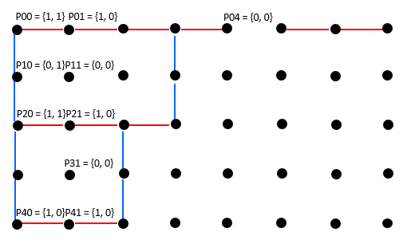

# 638 Largest Square Of Matches

Determine the largest square surrounded by a bunch of matches (each match is either horizontal or vertical), return the length of the largest square.

The input is a matrix of points. Each point has one of the following values:

0 - there is no match to its right or bottom.

1 - there is a match to its right.

2 - there is a match to its bottom.

3 - there is a match to its right, and a match to its bottom.

**Assumptions**

The given matrix is guaranteed to be of size M * N, where M, N >= 0

**Examples**

{{3, 1, 1, 3, 0, 1, 1, 0},

 {2, 0, 0, 2, 0, 0, 0, 0},

 {3, 1, 3, 0, 0, 0, 0, 0},

 {2, 0, 2, 0, 0, 0, 0, 0},

 {1, 1, 0, 0, 0, 0, 0, 0}}

This matrix represents the following bunch of matches:



The largest square has length of 2.

**Solution:**

```java
public class Solution {
  public int largestSquareOfMatches(int[][] matrix) {
    // Write your solution here
    // base case 
    int n = matrix.length;
    int m = matrix[0].length;
    if (n == 0 || m == 0){
      return 0;
    }

    int[][] right = new int[n][m];
    int[][] down = new int[n][m];
    int result = 0;
    for (int i = n-1; i >= 0; i--){
      for (int j = m-1; j >= 0; j--){
        if (matrix[i][j] == 1){
          right[i][j] = right[i][j+1] +1;
        }else if(matrix[i][j] == 2){
          down[i][j] = down[i+1][j] +1;
        }else if (matrix[i][j] == 3){
          right[i][j] = right[i][j+1]+1;
          down[i][j] = down[i+1][j] + 1;
        }else{
          continue;
        }

        for (int len = Math.min(right[i][j], down[i][j]); len > 0; len--){
          if (right[i+len][j] >= len && down[i][j+len] >= len){
            result = Math.max(result,len);
            break;
          }
        }
      }

    }

    return result;
  }
}
// TC: O(n^3)
// SC: O(n^2)
```


```java
public class Solution {
  public int largestSquareOfMatches(int[][] matrix) {
    int result = 0;

    if (matrix.length == 0 || matrix[0].length == 0) {
      return result;
    }

    int m = matrix.length;
    int n = matrix[0].length;

    int[][] right = new int[m][n + 1];
    int[][] down = new int[m + 1][n];

    for (int i = m - 1; i >= 0; --i) {
      for (int j = n - 1; j >= 0; --j) {
        if (matrix[i][j] == 1) {
          right[i][j] = right[i][j + 1] + 1;
        }

        if (matrix[i][j] == 2) {
          down[i][j] = down[i + 1][j] + 1;
        }

        if (matrix[i][j] == 3) {
          right[i][j] = right[i][j + 1] + 1;
          down[i][j] = down[i + 1][j] + 1;
            
          for (int len = Math.min(right[i][j], down[i][j]); len >= 1; --len) {   
            if (right[i + len][j] >= len && down[i][j + len] >= len) {
              result = Math.max(result, len);
              break;
            }
          }
        }
      }
    }

    return result;
  }
}
```


```java
public class Solution {
  public int largestSquareOfMatches(int[][] matrix) {
          // Assumptions: matrix is not null, size of M * N, where M, N >= 0
        // the elements in the matrix are either 0 or 1.
        if (matrix.length == 0 || matrix[0].length == 0){
            return 0;
        }
        int result = 0;
        int M = matrix.length;
        int N = matrix[0].length;
        // the longest right/down arm length ending at each position in the matrix.
        int[][] right = new int[M + 1][N + 1];
        int[][] down = new int[M + 1][N + 1];
        for (int i = M - 1; i >= 0; i--){
            for (int j = N - 1; j >= 0; j--){
                if (hasRight(matrix[i][j])){
                    right[i][j] = right[i][j + 1] + 1;
                }
                if (hasDown(matrix[i][j])){
                    down[i][j] = down[i + 1][j] + 1;
                }
                if (hasBoth(matrix[i][j])){
                    // the maximum length of a surrounded by 1 matrix with top-left
                    // position at matrix[i][j] is determined by the min value of
                    // right[i][j] and down[i][j],
                    // and we check one by one all the possible lengths if it can
                    // provide the actual matrix.
                    // we only need to check the longest bottom arm length of the bottom-left
                    // cell and the longest right arm length of the top-right cell.
                    for (int maxLength = Math.min(right[i][j], down[i][j]); maxLength >= 1; maxLength--){
                        if (right[i + maxLength][j] >= maxLength && down[i][j + maxLength] >= maxLength){
                            result = Math.max(result, maxLength);
                            break;
                        }
                    }

                }
            }
        }
        return result;
    }

    private static boolean hasRight(int value){
        return (value & 0b1) != 0;
    }

    private static boolean hasDown(int value){
        return (value & 0b10) != 0;
    }

    private static boolean hasBoth(int value){
        return value == 0b11;
    }
    // TC: O(N * M min(N, M))
    // SC: O(N * M)
}
```


