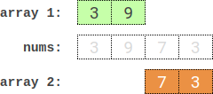

# 2035 Partition Array Into Two Arrays to Minimize Sum Difference

You are given an integer array `nums` of `2 * n` integers. You need to partition `nums` into **two** arrays of length `n` to **minimize the absolute difference** of the **sums** of the arrays. To partition `nums`, put each element of `nums` into **one** of the two arrays.

Return *the **minimum** possible absolute difference*.

 

**Example 1:**



```
Input: nums = [3,9,7,3]
Output: 2
Explanation: One optimal partition is: [3,9] and [7,3].
The absolute difference between the sums of the arrays is abs((3 + 9) - (7 + 3)) = 2.
```

**Example 2:**

```
Input: nums = [-36,36]
Output: 72
Explanation: One optimal partition is: [-36] and [36].
The absolute difference between the sums of the arrays is abs((-36) - (36)) = 72.
```

**Example 3:**


```
Input: nums = [2,-1,0,4,-2,-9]
Output: 0
Explanation: One optimal partition is: [2,4,-9] and [-1,0,-2].
The absolute difference between the sums of the arrays is abs((2 + 4 + -9) - (-1 + 0 + -2)) = 0.
```


**Solution:**

```java
class Solution {
    public int minimumDifference(int[] nums) {
      int n = nums.length; 
      // 1. find all subsets with size == n/2
      List<List<Integer>> result = new ArrayList<List<Integer>>();
      List<Integer> subResult = new ArrayList<Integer>();
      helper(nums, 0, subResult, result);
      int total = 0;
      for (int i = 0; i < nums.length; i++){
          total = nums[i] + total;
      }

      int res = Integer.MAX_VALUE;
      for (List<Integer> list : result){
          int subsetSum = 0;
          for (Integer i : list){
              subsetSum = subsetSum + i;
          }
          res = Math.min(res, Math.abs(total - subsetSum - subsetSum));
      }

      return res;


    }

    private static void helper(int[] nums, int index, List<Integer> subResult, List<List<Integer>> result){
        if (index == nums.length){
            return;
        }

        if (subResult.size() == nums.length/2){
            result.add(new ArrayList<Integer>(subResult));
            return;
        }

        // add
        subResult.add(nums[index]);
        helper(nums, index + 1, subResult, result);


        subResult.remove(subResult.size() - 1);
        // not add
        helper(nums, index + 1, subResult, result);
    }
}
// TLA
```


https://leetcode.com/problems/partition-array-into-two-arrays-to-minimize-sum-difference/solutions/3213827/java-eli5-explanation-meet-in-the-middle-two-pointer/

```java
class Solution {

	public int minimumDifference(int[] nums) {
		int n = nums.length / 2;
		int total = Arrays.stream(nums).sum();
		HashMap<Integer,List<Integer>> leftMap = new HashMap();
		HashMap<Integer,List<Integer>> rightMap = new HashMap();

		createSumMappings(0, leftMap, nums, n);
		createSumMappings(n, rightMap, nums, n);
        leftMap.put(0,Arrays.asList(0));
        rightMap.put(0,Arrays.asList(0));

		int min = Integer.MAX_VALUE;
		for(int i = 0; i <= n; i++){
            List<Integer> left = leftMap.get(i);
            List<Integer> right = rightMap.get(n - i);
            Collections.sort(left);
            Collections.sort(right);
            
            int p1 = 0, p2 = right.size() - 1;
            while(p1 < left.size() && p2 >= 0){
                int sum = left.get(p1) + right.get(p2);
                int remaining = total - sum;
                int diff =  Math.abs(remaining - sum);
                min = Math.min(min,diff);
                if(sum > total / 2) p2--;
                else p1++;
                
            }
        }
		return min;
	}
	public void createSumMappings(int offSet, HashMap < Integer, List < Integer >> map, int[] nums, int n) {
		for (int i = 1; i <= Math.pow(2, n) - 1; i++) {
			String binary = Integer.toBinaryString(i);
			int sum = 0,
			setBits = 0;
			for (int j = binary.length() - 1, index = nums.length - 1; j >= 0; j--, index--) {
				if (binary.charAt(j) == '1') {
					setBits++;
					sum += nums[index - offSet];
				}
			}
			if (!map.containsKey(setBits)) map.put(setBits, new ArrayList());
			map.get(setBits).add(sum);
		}
	}
}
```

