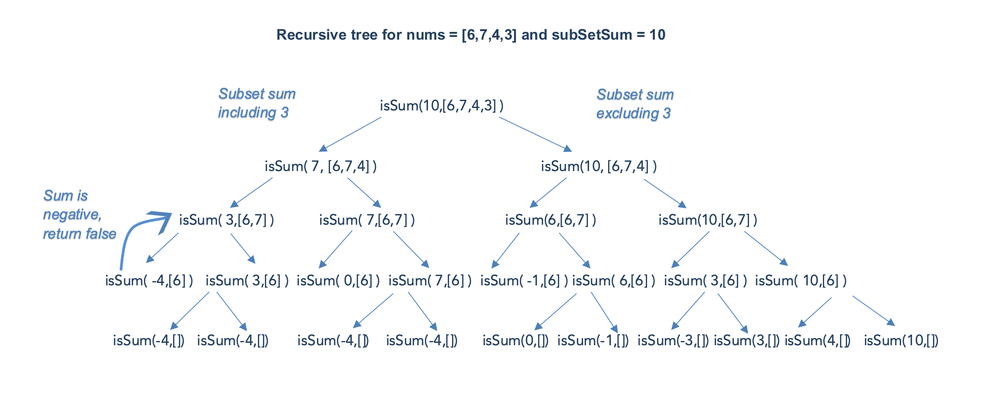

# 416 Partition Equal Subset Sum

Given an integer array `nums`, return `true` *if you can partition the array into two subsets such that the sum of the elements in both subsets is equal or* `false` *otherwise*.

**Example 1:**

```
Input: nums = [1,5,11,5]
Output: true
Explanation: The array can be partitioned as [1, 5, 5] and [11].
```

**Example 2:**

```
Input: nums = [1,2,3,5]
Output: false
Explanation: The array cannot be partitioned into equal sum subsets.
```


```java
class Solution {
    boolean flag = false;
    public boolean canPartition(int[] nums) {
        if (nums == null || nums.length == 0){
            return false;
        }

        int sum = 0;
        for (int i = 0; i < nums.length; i++){
            sum = nums[i] + sum;
        }

        int subSum = 0;
        if (sum % 2 != 0){
            return false;
        }
        helper(nums, 0, subSum, sum/2);
        return flag;
    }

    private void helper(int[] nums, int index, int subSum, int halfSum){
        // base case 
        if (index == nums.length){
          	return;
        }
      
      	// check
        if (subSum == halfSum){
             flag = true;
          	 return;
        }
            

        subSum = subSum + nums[index];
        helper(nums, index+1, subSum, halfSum);

        subSum = subSum - nums[index];
        helper(nums, index+1, subSum, halfSum);
    }
}

// TC: O(n*2^n) -> Time Limit Exceeded Leetcode
// SC: O(n)
```


**Solution 2**  2D Array:



In the above recursion tree, we could see that isSum(3,[6]) is computed twice and the result is always the same. Since the same subproblem is computed again and again, the problem has *Overlapping Subproblem* property and can be solved using *Dynamic Programming*.

**Algorithm**

We could have stored the results of our computation for the first time and used it later.
This technique of computing once and returning the stored value is called memoization.
We use a two dimensional array memo\text{memo}memo and follow the following steps for each recursive call :

- Check if subSetSum for a given n exists in memo to see if we can avoid computing the answer and return the result stored in memo.
- Save the results of any calculations to memo.

```java
class Solution {
    public boolean canPartition(int[] nums) {
        // base case
        if (nums == null || nums.length == 0){
            return false;
        }

        int sum = 0;
        for (int i = 0; i < nums.length; i++){
            sum = nums[i] + sum;
        }

        if (sum % 2 != 0){
            return false;
        }

        int halfSum = sum/2;
        
        Boolean[][] memo = new Boolean[nums.length+1][halfSum+1];
        // boolean can be yes or no
        // Boolean can be yes, no, or NULL
        return helper(nums,0, 0, halfSum, memo);
        

    }

    public boolean helper(int[] nums, int index, int subSum,int halfSum, Boolean[][] memo){
        // base case

        if (subSum == halfSum){
            return true;
        }

        if (index == nums.length || subSum > halfSum){
            return false;
        }


        if (memo[index][subSum] != null){
            return memo[index][subSum];
        }

        // add
        subSum = subSum + nums[index];
        boolean resultAdd = helper(nums, index + 1, subSum, halfSum, memo);
        subSum = subSum - nums[index];
        // not add
        boolean resultNot = helper(nums, index + 1, subSum, halfSum, memo);

        boolean result = (resultAdd || resultNot);
        memo[index][subSum] = result;
        return result;

        // boolean result = helper(nums, index+1, subSum, halfSum, memo) || helper(nums, index+1, subSum + nums[index], halfSum, memo);
    }

}
```


```java
class Solution {
    public boolean canPartition(int[] nums) {
        // base case
        if (nums == null || nums.length == 0){
            return false;
        }

        int sum = 0;
        for (int i = 0; i < nums.length; i++){
            sum = nums[i] + sum;
        }

        if (sum % 2 != 0){
            return false;
        }

        int halfSum = sum/2;
        
        Boolean[][] memo = new Boolean[nums.length + 1][halfSum + 1];
        return helper(nums, nums.length - 1, halfSum, memo);

    }

    public static boolean helper(int[] nums, int index, int halfSum, Boolean[][] memo){
        // base case
        if (halfSum == 0){
            return true;
        }

        if (index == 0 || halfSum < 0){
            return false;
        }

        // check if halfSum for given n is already computed and stored in memo
        
        if (memo[index][halfSum] != null){
            return memo[index][halfSum];
        }

        boolean result = helper(nums, index - 1, halfSum - nums[index-1], memo) || helper(nums, index-1, halfSum, memo);


        // store the result in memo
        memo[index-1][halfSum] = result;
        return result;
    }

}
// TC: O(n^2)
// In the worst case where there is no overlapping calculation, the maximum number of entries in the memo would be m⋅nm. For each entry, overall we could consider that it takes constant time, i.e. each invocation of dfs() at most emits one entry in the memo.

// The overall computation is proportional to the number of entries in memo. Hence, the overall time complexity is O(m⋅n).
// SC: O(n^2)
```

