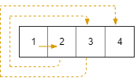

# 885 Spiral Matrix III

You start at the cell `(rStart, cStart)` of an `rows x cols` grid facing east. The northwest corner is at the first row and column in the grid, and the southeast corner is at the last row and column.

You will walk in a clockwise spiral shape to visit every position in this grid. Whenever you move outside the grid's boundary, we continue our walk outside the grid (but may return to the grid boundary later.). Eventually, we reach all `rows * cols` spaces of the grid.

Return *an array of coordinates representing the positions of the grid in the order you visited them*.

 

**Example 1:**



```
Input: rows = 1, cols = 4, rStart = 0, cStart = 0
Output: [[0,0],[0,1],[0,2],[0,3]]
```

**Example 2:**


```
Input: rows = 5, cols = 6, rStart = 1, cStart = 4
Output: [[1,4],[1,5],[2,5],[2,4],[2,3],[1,3],[0,3],[0,4],[0,5],[3,5],[3,4],[3,3],[3,2],[2,2],[1,2],[0,2],[4,5],[4,4],[4,3],[4,2],[4,1],[3,1],[2,1],[1,1],[0,1],[4,0],[3,0],[2,0],[1,0],[0,0]]
```

 

**Constraints:**

- `1 <= rows, cols <= 100`
- `0 <= rStart < rows`
- `0 <= cStart < cols`


**Solution:**

```java
class Solution {
    public int[][] spiralMatrixIII(int rows, int cols, int rStart, int cStart) {
        int total = rows * cols;
        int[][] result = new int[total][2];

        int count = 0;

        int left = cStart;
        int right = cStart+1;
        int up = rStart;
        int down = rStart + 1;

        while (count < total){
            // left -> right
            for (int i = left; i <= right && count < total; i++){
                count = countNum(result, count, rows, cols, up, i);
            }
            // 1 2

            // up -> down
            for (int j = up + 1; j <= down && count < total; j++){
                count = countNum(result, count, rows, cols, j, right);
            }

            // 3


            // right -> left

            for (int i = right -1; i >= left -1 && count < total; i--){
                count = countNum(result, count, rows, cols, down, i);
            }

            //4 5

            // down -> up

            for (int j = down -1; j >= up && count < total; j--){
                count = countNum(result, count, rows, cols, j , left-1);
            }

            left--;
            right++;
            up--;
            down++;
        }

        return result;
    }

    private int countNum(int[][] result, int count, int rows, int cols, int row, int col){
        if (row >= 0 && col >= 0 && row < rows && col < cols){
            result[count] = new int[]{row, col};
            count = count + 1;
        }
        return count;
    }
}
```

