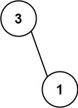

# 666 Path Sum IV

If the depth of a tree is smaller than `5`, then this tree can be represented by an array of three-digit integers. For each integer in this array:

- The hundreds digit represents the depth `d` of this node where `1 <= d <= 4`.
- The tens digit represents the position `p` of this node in the level it belongs to where `1 <= p <= 8`. The position is the same as that in a full binary tree.
- The units digit represents the value `v` of this node where `0 <= v <= 9`.

Given an array of **ascending** three-digit integers `nums` representing a binary tree with a depth smaller than `5`, return *the sum of all paths from the root towards the leaves*.

It is **guaranteed** that the given array represents a valid connected binary tree.

 

**Example 1:**


```
Input: nums = [113,215,221]
Output: 12
Explanation: The tree that the list represents is shown.
The path sum is (3 + 5) + (3 + 1) = 12.
```

**Example 2:**



```
Input: nums = [113,221]
Output: 4
Explanation: The tree that the list represents is shown. 
The path sum is (3 + 1) = 4.
```

 

**Solution**

```java
class Solution {  
    int total = 0;
    public int pathSum(int[] nums) {
        // base case
        if (nums == null || nums.length == 0){
            return 0;
        }

        if (nums.length == 1){
            return (nums[0] % 10);
        }

        // create Map to store the depth position value of node
        Map<Integer, Map<Integer, Integer>> map = new HashMap<Integer, Map<Integer,Integer>>();
        // depth,          position, value
        
        // add the information of the node to the map
        for (int i = 0; i < nums.length; i++){
            int depth = nums[i] / 100; // 950/100 = 9.5 -> 9
            int position = (nums[i]/ 10) % 10; // 215/10 = 21 % 10 = 1
            int value = nums[i] % 10;

            if (!map.containsKey(depth)){
                map.put(depth, new HashMap<Integer, Integer>());
            }

            map.get(depth).put(position, value);

        }

        int depth = 1;
        int position = 1;
        int sum = 0;
        helper(depth, position, map, sum);
        return total;
    }

    private void helper(int depth, int position, Map<Integer, Map<Integer, Integer>> map, int sum){
        // check wether node exist
        if (!map.containsKey(depth) || !map.get(depth).containsKey(position)){
            return;
        }

        // add the current val to sum

        int val = map.get(depth).get(position);
        sum = val + sum;

        // check wether is leaf -> update global total
        if (!map.containsKey(depth + 1) 
         || (!map.get(depth+1).containsKey(position * 2 -1) && !map.get(depth+1).containsKey(position * 2)) ){
             total = total + sum;
         }

         helper(depth +1, position * 2 -1 , map, sum);
         helper(depth +1, position * 2, map, sum);

         return;
    }
}

// TC: O(n)
// SC: O(n + n) = O(n)

//TC: O(n)
//SC: O(n)
```

