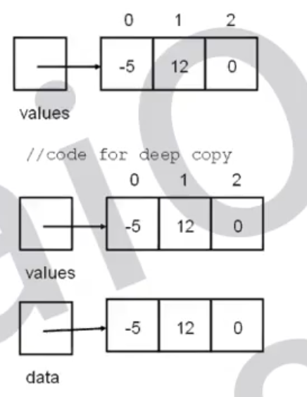

# 138 Copy List with Random Pointer

A linked list of length `n` is given such that each node contains an additional random pointer, which could point to any node in the list, or `null`.

Construct a [**deep copy**](https://en.wikipedia.org/wiki/Object_copying#Deep_copy) of the list. The deep copy should consist of exactly `n` **brand new** nodes, where each new node has its value set to the value of its corresponding original node. Both the `next` and `random` pointer of the new nodes should point to new nodes in the copied list such that the pointers in the original list and copied list represent the same list state. **None of the pointers in the new list should point to nodes in the original list**.

For example, if there are two nodes `X` and `Y` in the original list, where `X.random --> Y`, then for the corresponding two nodes `x` and `y` in the copied list, `x.random --> y`.

Return *the head of the copied linked list*.

The linked list is represented in the input/output as a list of `n` nodes. Each node is represented as a pair of `[val, random_index]` where:

- `val`: an integer representing `Node.val`
- `random_index`: the index of the node (range from `0` to `n-1`) that the `random` pointer points to, or `null` if it does not point to any node.

Your code will **only** be given the `head` of the original linked list.

 

**Example 1:**


```
Input: head = [[7,null],[13,0],[11,4],[10,2],[1,0]]
Output: [[7,null],[13,0],[11,4],[10,2],[1,0]]
```

**Example 2:**


```
Input: head = [[1,1],[2,1]]
Output: [[1,1],[2,1]]
```

**Example 3:**

****

```
Input: head = [[3,null],[3,0],[3,null]]
Output: [[3,null],[3,0],[3,null]]
```


**Solution:**

> Shallow Copy vs Deep Copy
>
> ```java
> public class ShallowCopy{
>   private int[] value = {-5, 12, 0}; // ref of value = 0xFFFF0001
>   private int[] data;
>   
>   // makes a shallow copy of values;
>   public ShallowCopy(int[] values){
>     data = values; // ref of data = value == 0xFFFF0001
>   }
> }
> ```
>
> 
>
> 
>
> DeepCopy creates (= new) an array and copies over the values;
>
> ```java
> public class DeepCopy{
>   private int[] value = {-5, 12, 0};   // ref of value = 0xFFFF0001
>   private int[] data;
>   
>   // deep copy of values
>   public DeepCopy(int[] values){
>     data = new int[values.length]; // ref of data = 0xFFFF0005
>     for (int i = 0; i < data.length; i++){
>       data[i] = values[i];
>     }
>   }
> }
> ```
>
> 
>
> 

```java
/*
// Definition for a Node.
class Node {
    int val;
    Node next;
    Node random;

    public Node(int val) {
        this.val = val;
        this.next = null;
        this.random = null;
    }
}
*/

class Solution {
    // Method 1: using HashMap to avoid copy multiple times for the same node
    public Node copyRandomList(Node head) {
        if (head == null){
            return null;
        }

        // Sential ndoe to help construct the deep copy.
        Node dummy = new Node(0); // value 0
        Node cur = dummy;
      //  0 -> 7 -> 13
      //  d
      //         c    
      //                    h
      // head = [[7,null],[13,0],[11,4],[10,2],[1,0]]

        // Maintains the mapping between the node in the original list and 
        // the corresponding node in the new list
        Map<Node, Node> map = new HashMap<>();
    		/*
    			Map: {7, [7]},{13,[13]} {}
    		*/
        while (head != null){
            // Copy the current node if necessary.
            if (!map.containsKey(head)){
                map.put(head, new Node(head.val));
            }

            // Connect the copied node to the deep copy list.
            cur.next = map.get(head);
            if (head.random != null){
                if (!map.containsKey(head.random)){
                    map.put(head.random, new Node(head.random.val));
                }
                // Connect the copied node to the random pointer.
                cur.next.random = map.get(head.random);
            }
            head = head.next;
            cur = cur.next;
        }
        return dummy.next;
        
    }
}
//TC: O(n)
//SC: O(n)
```


