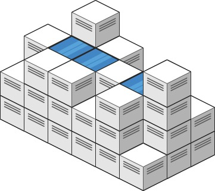

# 407 Trapping Rain Water II

Given an `m x n` integer matrix `heightMap` representing the height of each unit cell in a 2D elevation map, return *the volume of water it can trap after raining*.

 

**Example 1:**



```
Input: heightMap = [[1,4,3,1,3,2],[3,2,1,3,2,4],[2,3,3,2,3,1]]
Output: 4
Explanation: After the rain, water is trapped between the blocks.
We have two small ponds 1 and 3 units trapped.
The total volume of water trapped is 4.
```

**Example 2:**


```
Input: heightMap = [[3,3,3,3,3],[3,2,2,2,3],[3,2,1,2,3],[3,2,2,2,3],[3,3,3,3,3]]
Output: 10
```


**Solution:**

99999995999

91110117119

91111111189

91111111619

91111119119

91612111999

91111111159

91111111119

91111111119

99999999999

case1	x < 5	water = 5 - 2

case2	x == 5      water = 0

case3 	x > 5	water = 5 - 7 = -2 	->	0

key point2: 每次由cur流向nei的过程中, nei的水位线也应该根据cur的水位线来去更新

Data structure: 木桶的边缘 put into heap

Initialize: 木桶的边缘 = 矩形的四条边	put into minHeap

In each step:

​	Find the shortest board

expand cur : 5

​	Determine the water level of its neighbors

​		case 1: height(neightbor) 2 <= cur shortest board's level(5)

​			watert(neighbor) = cur shortest board's level 5 - height(neighbor) 2 = 3

​			level(neighbor) = cur shortst board's level(5)

​		Case 2: height(neighbor) 7 > cur shortest board's level 5

​			watert(neigthbor) = cur shortest board's level 5 - height(neighbor) 7 = -2, max(-2, 0)

​			level(neighbor) = height(neighbor)

-> 

watert(neighbor) = Max.max(0, cur shortest board's level - height(neightbor))

level(neighbor) = max(height(neighbor), cur shortest board's level)

​	remove the shortest board from perimeter

​	Add its neighbors to the perimeter

先把边界放进heap, 每次expand最小点, generate neigh (去重) -> 计算nei能积的水位, 更新nei的水位线, put nei into heap


Insert all Pi into MIN_HEAP (= set of active points)

While MIN_HEAP is not empty: // Best First Search (BFS2)

​	P = MIN_HEAP.pop()     // Select the active point P with minimum level

​	For every point Q adjacent to P: 

​		If Level(Q) is infinity: // dedup

​			SUM += Max(0, Level(P) - Height(Q));

​			Level(Q) = max(Height(Q), Level(P))

​			Add Q to the MIN_HEAP

TC: mn* logmn

SC: mn

一共存多少水 -> sum(在每个点上存多少水) -> 在<i, j> 点上水位线的高度

For every point Pi \<xi yi zi> on the border, set the water level to <zi>

For every point Pj not on the border set the water level to infinity.

```java
class Solution {
    public int trapRainWater(int[][] heightMap) {
        int rows = heightMap.length;
        int cols = heightMap[0].length;

        if (rows < 3 || cols < 3){
            return 0;
        }

        PriorityQueue<Pair> minHeap = new PriorityQueue<Pair>();
        boolean[][] visited = new boolean[rows][cols];


        // put all the border cells of the matrix at the beginning.
        for (int i = 0; i < rows; i++){
            for (int j = 0; j < cols; j++){
                if (i == 0 || j == 0 || i == rows - 1 || j == cols - 1){
                    minHeap.offer(new Pair(i , j, heightMap[i][j]));
                    visited[i][j] = true;
                }

            }
        }

        int result = 0;
        while(!minHeap.isEmpty()){
            Pair cur = minHeap.poll();
            List<Pair> neightbors = new ArrayList<Pair>();
            if (cur.x + 1 < rows){
                neightbors.add(new Pair(cur.x + 1, cur.y, heightMap[cur.x + 1][cur.y]));
            }

            if (cur.x - 1 >= 0){
                neightbors.add(new Pair(cur.x -1, cur.y, heightMap[cur.x - 1][cur.y]));
            }

            if (cur.y + 1 < cols){
                neightbors.add(new Pair(cur.x, cur.y+1, heightMap[cur.x][cur.y + 1]));
            }

            if (cur.y - 1 >= 0){
                neightbors.add(new Pair(cur.x, cur.y - 1, heightMap[cur.x][cur.y-1]));
            }

            for (Pair nei : neightbors){
                if (visited[nei.x][nei.y]){
                    continue;
                }

                visited[nei.x][nei.y] = true;

                result = result + Math.max(cur.height - nei.height, 0);

                nei.height = Math.max(cur.height, nei.height);
                minHeap.offer(nei);
            }

        }
        return result;
        
    }

    static class Pair implements Comparable<Pair>{
        int x;
        int y;
        int height;

        Pair(int x, int y, int height){
            this.x = x;
            this.y = y;
            this.height = height;
        }

        @Override
        public int compareTo(Pair another){
            if (this.height == another.height){
                return 0;
            }else if (this.height < another.height){
                return -1;
            }else{
                return 1;
            }
        }
    }
}
```


```java 
class Solution {
    public int trapRainWater(int[][] heightMap) {
        // Asumptions: matrix is not null, has size of M * N,
        // M > 0 & N > 0, all the values are non-negative integers.
      // 用一个minHeap先从最外面一圈找到最小的level, 确定他的积水, 之后确定他邻居的水位
      // 确定完后扔掉这个格子, generate他的邻居再确定邻居的水位level
      // 同理于二维柱子, heap是否为空对应双指针走到哪里, 取min操作对应比较左右max哪个小
      // BFS2 generate邻居节点对应移动指针得出新的左右max的值
        int rows = heightMap.length; 
        int cols = heightMap[0].length;
      // 不够中间包裹住一个的size直接返回0
        if (rows < 3 || cols < 3){
            return 0;
        }
        // Best-First-Seatch, minHeap maintains all the border cells
        // of the "closed area" and always find the one with lowest
        // height to see if any of its neighbors can trap any water.
        PriorityQueue<Pair> minHeap = new PriorityQueue<Pair>();
        boolean[][] visited = new boolean[rows][cols];
      // 首先把边界上的每个点都放进pq中兵标记visited
        // put all the border cells of the matrix at the beginning.
        processBorder(heightMap, visited, minHeap, rows, cols);
        int result = 0;
        while(!minHeap.isEmpty()){
            Pair cur = minHeap.poll();
            // get all possible neighbor cells.
            List<Pair> neightbors = allNeighbors(cur, heightMap, visited);
            for (Pair nei : neightbors){
                // if any neighbor has been visited before, we just ignore.
                // 如果该nei已经被访问过则忽略
                if (visited[nei.x][nei.y]){
                    continue;
                }
                // adjust the neighbor cell's height to the current water level
                // if necessary, mark the neighbor cell as visited, and put the 
                // neighbor cell into the min heap.
                visited[nei.x][nei.y] = true;
              // 算积水的容量, 用最大边界和自己的高度比

                // how much water can be trapped at the neighbor cell.
                // the maximum water level currently is controlled by the cur cell.
                result = result + Math.max(cur.height - nei.height, 0);
              // 更新邻居点的最大水位较高的那一个水位
                nei.height = Math.max(cur.height, nei.height);
                minHeap.offer(nei);
            }
        }
        return result;
    }

    // put all the border cells into the min heap at the very beginning, 
    // there are the start points of the whole BFS process.
    private void processBorder(int[][] matrix, boolean[][] visited, PriorityQueue<Pair> minHeap, int rows, int cols){
        for (int j = 0; j < cols; j++){
            minHeap.offer(new Pair(0, j, matrix[0][j]));
            minHeap.offer(new Pair(rows - 1, j, matrix[rows - 1][j]));
            visited[0][j] = true;
            visited[rows - 1][j] = true;
        }

        for (int i = 1; i < rows - 1; i++){
            minHeap.offer(new Pair(i, 0, matrix[i][0]));
            minHeap.offer(new Pair(i, cols - 1, matrix[i][cols-1]));
            visited[i][0] = true;
            visited[i][cols - 1] = true;
        }
    }

    private List<Pair> allNeighbors(Pair cur, int[][] matrix, boolean[][] visited){
        List<Pair> neis = new ArrayList<>();
        if (cur.x + 1 < matrix.length){
            neis.add(new Pair(cur.x + 1, cur.y, matrix[cur.x + 1][cur.y]));
        }

        if (cur.x - 1 >= 0){
            neis.add(new Pair(cur.x-1, cur.y, matrix[cur.x -1][cur.y]));
        }

        if (cur.y + 1 < matrix[0].length){
            neis.add(new Pair(cur.x, cur.y + 1, matrix[cur.x][cur.y + 1]));
        }

        if (cur.y - 1 >= 0){
            neis.add(new Pair(cur.x, cur.y - 1, matrix[cur.x][cur.y - 1]));
        }

        return neis;
    }

    static class Pair implements Comparable<Pair>{
        int x; // row index;
        int y; // column index.
        int height; // height of the cell in the original matrix.
      // 最大边界高度

        Pair(int x, int y, int height){
            this.x = x;
            this.y = y;
            this.height = height;
        }
				
      	// 实现pq中国呢优先级比较的方式, 实现Comparable接口重写compareTo方法
      // 或者提供一个Comparator<E>类型提供compare方法, 把这个Comparator的对象传到PQ中
        @Override
        public int compareTo(Pair another){
            if (this.height == another.height){
                return 0;
            }
            return this.height < another.height ? -1 : 1;
        }
    }
}

// TC: O(mnlog(m+n))
// SC: O(mn)
```


```java
public class Solution {
  class Node {
    int x, y, val;
    public Node(int i, int j, int k) {
      x = i;
      y = j;
      val = k;
    }
  }
  public int maxTrapped(int[][] matrix) {
    int m = matrix.length, n = matrix[0].length;
    if (m < 3 || n < 3) {
      return 0;
    }
    PriorityQueue<Node> pq = new PriorityQueue<>(1, new Comparator<Node>() {
      public int compare(Node a, Node b) {
        return a.val - b.val;
      }
    });
    boolean[][] visited = new boolean[m][n];
    for (int i = 0; i < n; i++) {
      pq.offer(new Node(0, i, matrix[0][i]));
      pq.offer(new Node(m - 1, i, matrix[m - 1][i]));
      visited[0][i] = true;
      visited[m - 1][i] = true;
    }
    for (int i = 1; i < m; i++) {
      pq.offer(new Node(i, 0, matrix[i][0]));
      pq.offer(new Node(i, n - 1, matrix[i][n - 1]));
      visited[i][0] = true;
      visited[i][n - 1] = true;
    }
    int ans = 0;
    int[] dx = {0, 1, 0, -1};
    int[] dy = {1, 0, -1, 0};
    while (!pq.isEmpty()) {
      Node cur = pq.poll();
      for (int i = 0; i < 4; i++) {
        int x = cur.x + dx[i], y = cur.y + dy[i];
        if (x >= 0 && x < m && y >= 0 && y < n && !visited[x][y]) {
          if (matrix[x][y] < cur.val) {
            ans += cur.val - matrix[x][y];
            pq.offer(new Node(x, y, cur.val));
          } else {
            pq.offer(new Node(x, y, matrix[x][y]));
          }
          visited[x][y] = true;
        }
      }
    }
    return ans;
  }
}
```

