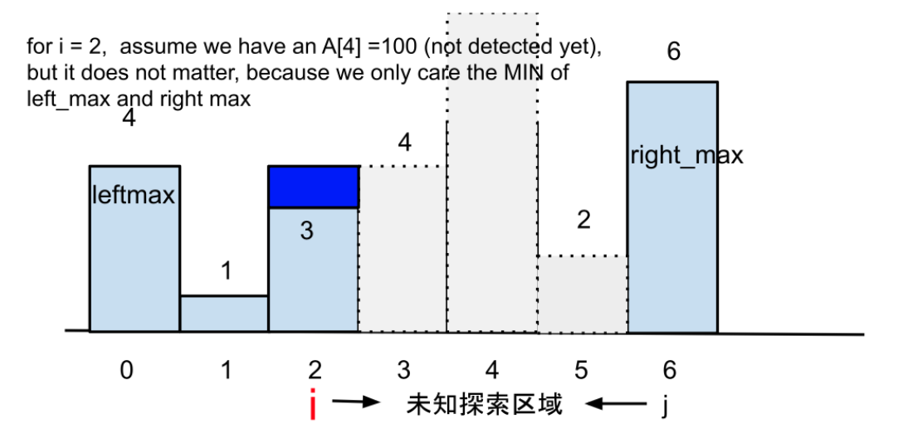

# 42 Trapping Rain Water

Given `n` non-negative integers representing an elevation map where the width of each bar is `1`, compute how much water it can trap after raining.

 

**Example 1:**


```
Input: height = [0,1,0,2,1,0,1,3,2,1,2,1]
Output: 6
Explanation: The above elevation map (black section) is represented by array [0,1,0,2,1,0,1,3,2,1,2,1]. In this case, 6 units of rain water (blue section) are being trapped.
```

**Example 2:**

```
Input: height = [4,2,0,3,2,5]
Output: 9
```


**Solution:**

Solution1: 中心开花, 对于每个点, 往左往右找到左右的最大边界, 最大边界里面较小的哪个就是我这个一个点的水位线, 我的水量 = 我的水位线 - 我的高度

TC: O(n^2)

```java
class Solution {
    public int trap(int[] height) {
        int result = 0;
        int size = height.length;
        for (int i = 1; i < size - 1; i++){
            int left_max = 0;
            int right_max = 0;
            for (int j = i; j >= 0; j--){ // search the left part for max bar size
                left_max = Math.max(left_max, height[j]);
            }

            for (int j = i; j < size; j++){
                // search the right part for max bar size
                right_max = Math.max(right_max, height[j]);
            }
            result = result + Math.min(left_max, right_max) - height[i];
        }
        return result;
        
    }
}
// TC: O(n^2)
// SC: O(1)
```


Solution2: DP

从一个点往左边走找最大值 -> 从左边走到我自己这个过程中的max, leftMaxsoFar

从一个点往右边走找最大值 -> 从右边走到我自己这个过程中的max, righttMaxsoFar

一共存多少水 -> sum(在每个点上存多少水) -> 在位置i点上水位线的高度 -> 从边缘往中间走的最大高度 -> min(left_max(prevMax, currentHeight), right_max(prevMax, currentHeight))

Step 1:

input = 		{4, 1, 3, 4, 5, 2, 6}

left_max  	=    4, 4, 4, 4, 5, 5, 6   // 从左往右until now max

right_max        =    6, 6, 6, 6, 6, 6, 6 // 从右往左until now max

水位线高	 =    4  4  4   4  5 5 6  // 每一个点左右高度里面较小 -> 水位线

Step 2: 

for each index i

water[i] = min(leftMax[i], rightMax[i] - input[i])

sum = sum + water[i]

Time = O(3n) -> O(n), 3n

Sapce = O(2n) -> O(n), 2n


```java
class Solution {
    public int trap(int[] height) {
        if (height == null || height.length <= 2){
            return 0;
        }

        int result = 0;
        int size = height.length;
        int[] left_max = new int[size];
        int[] right_max = new int[size];

        left_max[0] = height[0];
        for (int i = 1; i < size; i++){
            left_max[i] = Math.max(height[i], left_max[i-1]);
        }

        right_max[size - 1] = height[size - 1];
        for (int i = size - 2; i >= 0; i--){
            right_max[i] = Math.max(height[i], right_max[i+1]);
        }

        for (int i = 1; i < size - 1; i++){
            result = result + (Math.min(left_max[i], right_max[i]) - height[i]);
        }

        return result;
        
    }
}

// TC: O(n)
// SC: O(1)
```


**Solution3:** 

Optimized solution

initialization:

i = 0

j = n - 1

leftMax = A[0],

rightMax = A[n-1]



For an index i, how much water can store in i-th indexed place?

It depends on min(highest bar on the left of i (including i), 

​				  highest bar on the right of i (including i))

height of i (if < 0, then set it to 0)

Initially, set left index i = 0; right index j = n - 1, 左右对进

Induction 推理, 从 i -> i+1 分析问题

Case 1: if left_max < right_max, we already know that the water stotred in i + 1 can be calculated safely, so i++;

why?

Case 1.1: A[i + 1] <= left_max, then left_max is not updated, left border is still valid and does not change, so water at i+1 == left_max-A[i+1];

Case 1.2: A[i+1] <= left_max then left max is updated to A[i+1], water at i+1 == new_left_max-A[i+1] = A[i+1] - A[i+1] = 0;

Case 2: else, j--;

t1 i = 0, j = 6 leftMax = 4, rightMax = 6

t2 i = 1, j = 6 leftMax = 4, rightMax = 6

t3 i = 2, j = 6, leftMax = 4, rightMax = 6

Example: left_max[i, ..., j] right_max

Step 1: i = 0, j = n-1                    

min(A[0], A[6]) = min = (3, 6) = 3, 

最短板在i = 0, so water height at index i == min(left_max, right_max) - A[i] = 3-3=0;

i++; // left_max vs right_max 哪边小就移动哪边; why?

木桶理论: 盯住最短板, 谁小移动谁

(1) if left_max 小就移动i (i++), 

(2) else 移动j (j--)

```java
class Solution {
    public int trap(int[] height) {
        if (height.length == 0){
            return 0;
        }
        int left = 0;
        int right = height.length - 1;
        int result = 0;
        int lmax = height[left];
        int rmax = height[right];
        while(left < right){
            if (height[left] <= height[right]){
                result = result + Math.max(0, lmax - height[left]);
                lmax = Math.max(lmax, height[left]);
                left++;
            }else{
                result = result + Math.max(0, rmax - height[right]);
                rmax = Math.max(rmax, height[right]);
                right--;
            }
        }
        return result;
    }
}
// TC: O(n)
// SC: O(1)
```

