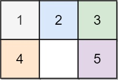
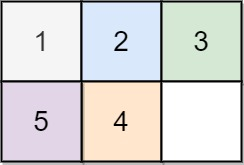

# 773 Sliding Puzzle

On an `2 x 3` board, there are five tiles labeled from `1` to `5`, and an empty square represented by `0`. A **move** consists of choosing `0` and a 4-directionally adjacent number and swapping it.

The state of the board is solved if and only if the board is `[[1,2,3],[4,5,0]]`.

Given the puzzle board `board`, return *the least number of moves required so that the state of the board is solved*. If it is impossible for the state of the board to be solved, return `-1`.

 

**Example 1:**



```
Input: board = [[1,2,3],[4,0,5]]
Output: 1
Explanation: Swap the 0 and the 5 in one move.
```

**Example 2:**



```
Input: board = [[1,2,3],[5,4,0]]
Output: -1
Explanation: No number of moves will make the board solved.
```

**Example 3:**


```
Input: board = [[4,1,2],[5,0,3]]
Output: 5
Explanation: 5 is the smallest number of moves that solves the board.
An example path:
After move 0: [[4,1,2],[5,0,3]]
After move 1: [[4,1,2],[0,5,3]]
After move 2: [[0,1,2],[4,5,3]]
After move 3: [[1,0,2],[4,5,3]]
After move 4: [[1,2,0],[4,5,3]]
After move 5: [[1,2,3],[4,5,0]]
```


**Solution:**

```java
class Solution {
    static class Board{
        public final static int R = 2;
        public final static int C = 3;
        public int[][] b = new int[R][C];

        public Board(){

        }

        public Board(int[][] values){
            for (int i = 0; i < R; i++){
                for (int j = 0; j < C; j++){
                    b[i][j] = values[i][j];
                }
            }
        }

        public void swap(int i1, int j1, int i2, int j2){
            int temp = b[i1][j1];
            b[i1][j1] = b[i2][j2];
            b[i2][j2] = temp;
        }

        public int[] findZero(){
            for (int i = 0; i < R; i++){
                for (int j = 0; j < C; j++){
                    if (b[i][j] == 0){
                        return new int[]{i,j};
                    }
                }
            }

            return null;
        }

        public boolean outOfBound(int i , int j){
            return i < 0 || i >= R || j < 0|| j>= C;
        }

        @Override
        public int hashCode(){
            int code =0;
            for (int i = 0; i < R; i++){
                for (int j = 0; j < C; j++){
                    code = code * 10 + b[i][j];
                }       
            }
            return code;
        }

        @Override
        public boolean equals(Object o){ 
            // checks if the object o is an instance of the Board class
            if (!(o instanceof Board)){
                return false;
            }
            Board c = (Board) o;
            for (int i = 0; i < R; i++){
                for (int j = 0; j < C; j++){
                    if (b[i][j] != c.b[i][j]){
                        return false;
                    }
                }
            }
            return true;
        }

        @Override 
        public Board clone(){
            Board c = new Board();
            for (int i = 0; i < R; i++){
                for (int j = 0; j < C; j++){
                    c.b[i][j] = b[i][j];
                }
            }

            return c;
        }


    }

    final static int[][] DIRS = {{-1,0}, {1,0}, {0, -1}, {0, 1}};
    public int slidingPuzzle(int[][] board) {
        Queue<Board> queue = new ArrayDeque<Board>();
        Map<Board, Integer> map = new HashMap<Board, Integer>();

        Board start = new Board(new int[][]{{1,2,3},{4,5,0}});
        queue.offer(start);
        map.put(start, 0);

        while(!queue.isEmpty()){
            Board cur = queue.poll();
            int step = map.get(cur);

            int[] zeroPos = cur.findZero();
            int zeroI = zeroPos[0];
            int zeroJ = zeroPos[1];

            for (int[] dir : DIRS){
                int i = zeroI + dir[0];
                int j = zeroJ + dir[1];
                if (!cur.outOfBound(i,j)){
                    cur.swap(zeroI, zeroJ, i, j);
                    if (!map.containsKey(cur)){
                        Board newBoard = cur.clone();
                        queue.offer(newBoard);
                        map.put(newBoard, step+1);
                    }
                    cur.swap(zeroI, zeroJ, i, j);
                }
            }
        }

        return map.getOrDefault(new Board(board),-1);
    }
}

// TC: O(6!)
// SC: O(6!*6)
```


```java
class Solution {
    int[][] DIR = new int[][]{{-1, 0}, {1, 0}, {0, -1}, {0, 1}};
    public int slidingPuzzle(int[][] board) {
        //convert board to string
        String startBoard = getBoard(board);
        String targetBoard = "123450";

        HashSet<String> visited = new HashSet<>();
        Queue<String> queue = new LinkedList<>();
        queue.offer(startBoard);
        visited.add(startBoard);
        int steps = 0;

        while (!queue.isEmpty()) {
            int size = queue.size();
            for (int i = 0; i < size; i++) {
                String currentBoard = queue.poll();
                if (currentBoard.equals(targetBoard)) {
                    return steps;
                }

                getNextBoard(currentBoard, visited, queue);
            }
            steps++;
        }

        return -1;
    }

    private String getBoard(int[][] board) {
        StringBuilder sb = new StringBuilder();
        for (int i = 0; i < 2; i++) {
            for (int j = 0; j < 3; j++) {
                sb.append(board[i][j]);
            }
        }
        return sb.toString();
    }

    private void getNextBoard(String board, HashSet<String> visited, Queue<String> queue) {
        //find empty block
        int emptyIndex = 0;
        for (int i = 0; i < 6; i++) {
            if (board.charAt(i) == '0') {
                emptyIndex = i;
                break;
            }
        }

        //move in four directions and convert the (row, col) to 1D index
        for (int[] dir : DIR) {
            int newRow = dir[0] + emptyIndex/3, newCol = dir[1] + emptyIndex%3;
            int newIndex = newRow * 3 + newCol;
            if (newRow >= 0 && newRow < 2 && newCol >= 0 && newCol < 3) {
                StringBuilder newBoard = new StringBuilder();
                for (int j = 0; j < 6; j++) {
                    if (j == emptyIndex) {
                        newBoard.append(board.charAt(newIndex));
                    } else if (j == newIndex) {
                        newBoard.append("0");
                    } else {
                        newBoard.append(board.charAt(j));
                    }
                }
                
                String newBoardString = newBoard.toString();
                if (!visited.contains(newBoardString)) {
                    visited.add(newBoardString);
                    queue.offer(newBoardString);
                }
            }
        }
    }
}
```


在Java中，`hashCode()`, `clone()`, 和 `equals()` 方法经常被重写（override）以满足特定的需求。这些方法在处理对象的比较、复制和散列时非常重要。让我用一个例子来解释为什么要重写这些方法。

### 示例场景

假设你在开发一个简单的线上图书馆系统。这个系统中有一个`Book`类，它包含书名和作者。我们希望能够比较两本书是否相同，复制书籍信息，以及将书籍存储在一个集合中。

### `equals()` 方法

- **目的**：确定两个对象是否“相等”。
- **例子**：我们希望两本书如果书名和作者都相同，就被认为是相同的。默认的`equals()`方法只比较对象的内存地址，这对我们来说是不够的。
- **重写**：我们重写`equals()`来比较书名和作者，而不是比较引用地址。

```
javaCopy code
public class Book {
    private String title;
    private String author;

    @Override
    public boolean equals(Object obj) {
        if (this == obj) return true;
        if (obj == null || getClass() != obj.getClass()) return false;
        Book book = (Book) obj;
        return title.equals(book.title) && author.equals(book.author);
    }
}
```

### `hashCode()` 方法

- **目的**：生成对象的散列码，用于散列基础的数据结构，如`HashSet`或`HashMap`。
- **例子**：如果我们将`Book`对象存储在`HashSet`中，并且我们希望集合中不包含重复的书籍（基于书名和作者）。
- **重写**：由于`equals()`被重写了，我们也需要重写`hashCode()`以确保当两个`Book`对象“相等”时，它们的哈希码也相同。

```
javaCopy code
@Override
public int hashCode() {
    return Objects.hash(title, author);
}
```

### `clone()` 方法

- **目的**：创建对象的一个精确副本。
- **例子**：假设我们需要创建一个书籍的副本来进行编辑，而不影响原始书籍。
- **重写**：我们重写`clone()`方法来确保当我们克隆`Book`对象时，它的所有属性（书名和作者）都被正确复制。

```
javaCopy code
@Override
protected Object clone() throws CloneNotSupportedException {
    return new Book(this.title, this.author);
}
```

### 结论

在这个例子中，我们重写`equals()`来实现基于属性的比较，重写`hashCode()`以确保可以将`Book`对象正确地用作散列集合的键，而重写`clone()`则用于创建书籍的精确副本。这些重写确保了类的正确和高效运行，特别是在涉及到集合和对象比较时。
