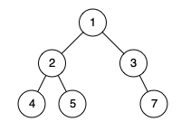

# 958 Check Completeness of a Binary Tree

Given the `root` of a binary tree, determine if it is a *complete binary tree*.

In a **[complete binary tree](http://en.wikipedia.org/wiki/Binary_tree#Types_of_binary_trees)**, every level, except possibly the last, is completely filled, and all nodes in the last level are as far left as possible. It can have between `1` and `2h` nodes inclusive at the last level `h`.

 

**Example 1:**


```
Input: root = [1,2,3,4,5,6]
Output: true
Explanation: Every level before the last is full (ie. levels with node-values {1} and {2, 3}), and all nodes in the last level ({4, 5, 6}) are as far left as possible.
```

**Example 2:**



```
Input: root = [1,2,3,4,5,null,7]
Output: false
Explanation: The node with value 7 isn't as far left as possible. 
```


**Solution:**

```java
/**
 * Definition for a binary tree node.
 * public class TreeNode {
 *     int val;
 *     TreeNode left;
 *     TreeNode right;
 *     TreeNode() {}
 *     TreeNode(int val) { this.val = val; }
 *     TreeNode(int val, TreeNode left, TreeNode right) {
 *         this.val = val;
 *         this.left = left;
 *         this.right = right;
 *     }
 * }
 */
class Solution {
    public boolean isCompleteTree(TreeNode root) {
        if (root == null){
            return true;
        }

        Queue<TreeNode> queue = new LinkedList<TreeNode>();
        
        boolean flag = false;

        queue.offer(root);
        
        while(!queue.isEmpty()){
            TreeNode cur = queue.poll();
            if (cur.left == null){
                flag = true;
            }else if (flag){
                return false;
            }else{
                queue.offer(cur.left);
            }

            if (cur.right == null){
                flag = true;
            }else if (flag){
                return false;
            }else{
                queue.offer(cur.right);
            }
        }

        return true;
        
    }
}


// TC: O(n)
// SC: O(n)
```

