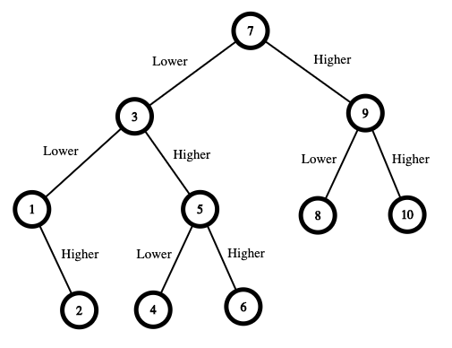

---
tags:
  Math
  Dynamic Programming
  Game Theory
---


# 375 Guess Number Higher or Lower II

We are playing the Guessing Game. The game will work as follows:

1. I pick a number between `1` and `n`.
2. You guess a number.
3. If you guess the right number, **you win the game**.
4. If you guess the wrong number, then I will tell you whether the number I picked is **higher or lower**, and you will continue guessing.
5. Every time you guess a wrong number `x`, you will pay `x` dollars. If you run out of money, **you lose the game**.

Given a particular `n`, return *the minimum amount of money you need to **guarantee a win regardless of what number I pick***.

 

**Example 1:**



```
Input: n = 10
Output: 16
Explanation: The winning strategy is as follows:
- The range is [1,10]. Guess 7.
    - If this is my number, your total is $0. Otherwise, you pay $7.
    - If my number is higher, the range is [8,10]. Guess 9.
        - If this is my number, your total is $7. Otherwise, you pay $9.
        - If my number is higher, it must be 10. Guess 10. Your total is $7 + $9 = $16.
        - If my number is lower, it must be 8. Guess 8. Your total is $7 + $9 = $16.
    - If my number is lower, the range is [1,6]. Guess 3.
        - If this is my number, your total is $7. Otherwise, you pay $3.
        - If my number is higher, the range is [4,6]. Guess 5.
            - If this is my number, your total is $7 + $3 = $10. Otherwise, you pay $5.
            - If my number is higher, it must be 6. Guess 6. Your total is $7 + $3 + $5 = $15.
            - If my number is lower, it must be 4. Guess 4. Your total is $7 + $3 + $5 = $15.
        - If my number is lower, the range is [1,2]. Guess 1.
            - If this is my number, your total is $7 + $3 = $10. Otherwise, you pay $1.
            - If my number is higher, it must be 2. Guess 2. Your total is $7 + $3 + $1 = $11.
The worst case in all these scenarios is that you pay $16. Hence, you only need $16 to guarantee a win.
```

**Example 2:**

```
Input: n = 1
Output: 0
Explanation: There is only one possible number, so you can guess 1 and not have to pay anything.
```

**Example 3:**

```
Input: n = 2
Output: 1
Explanation: There are two possible numbers, 1 and 2.
- Guess 1.
    - If this is my number, your total is $0. Otherwise, you pay $1.
    - If my number is higher, it must be 2. Guess 2. Your total is $1.
The worst case is that you pay $1.
```


**Solution:**

```java
public class Solution {
    public int getMoneyAmount(int n) {
        // 创建一个二维数组来保存每个区间的最小成本
        int[][] cost = new int[n + 1][n + 1];

        // cost[i][j] represents 

        // 遍历所有可能的区间长度
        for (int len = 2; len <= n; len++) {
            // 遍历每个长度的所有可能的起始点
            for (int start = 1; start <= n - len + 1; start++) {
                // start 加上区间长度 len 不能超过 n
                int end = start + len - 1;
                int minCostForRange = Integer.MAX_VALUE;

                // 在当前区间内，尝试每一个可能的猜测点
                 for (int guess = start; guess <= end; guess++) {
                    int costLeft = 0;
                    int costRight = 0;

                    // 如果猜测点左侧有数字，则计算左侧区间的成本
                    if (guess > start) {
                        costLeft = cost[start][guess - 1];
                    }

                    // 如果猜测点右侧有数字，则计算右侧区间的成本
                    if (guess < end) {
                        costRight = cost[guess + 1][end];
                    }

                    // 猜错时的成本是猜测点的值加上左右区间中较大的成本
                    int costIfWrong = guess + Math.max(costLeft, costRight);

                    // 更新当前区间的最小成本
                    minCostForRange = Math.min(minCostForRange, costIfWrong);
                }
                // 保存当前区间的最小成本
                cost[start][end] = minCostForRange; // 注意是start to end
            }
        }

        // 返回整个区间的最小成本
        return cost[1][n];
    }
}

// TC: O(n^3)
// SC: O(n^2)

/*
why start <= n - len + 1
假设 n = 5（即我们的数字范围是从 1 到 5），我们当前考虑的区间长度 len 是 3。我们需要确定 start 的范围，即我们从哪里开始这个长度为 3 的区间。

如果 start = 1，那么区间是 [1, 2, 3]（长度为 3）。
如果 start = 2，那么区间是 [2, 3, 4]（长度为 3）。
如果 start = 3，那么区间是 [3, 4, 5]（长度为 3）
*/
```

