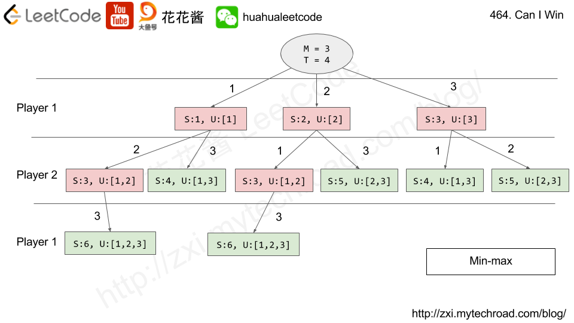

---
tags:
  Math
  Dynamic Programming
  Bit manipulation	
  Memoization
  Game Theory
  Bitmask
---

# 464 Can I Win

In the "100 game" two players take turns adding, to a running total, any integer from `1` to `10`. The player who first causes the running total to **reach or exceed** 100 wins.

What if we change the game so that players **cannot** re-use integers?

For example, two players might take turns drawing from a common pool of numbers from 1 to 15 without replacement until they reach a total >= 100.

Given two integers `maxChoosableInteger` and `desiredTotal`, return `true` if the first player to move can force a win, otherwise, return `false`. Assume both players play **optimally**.

 

**Example 1:**

```
Input: maxChoosableInteger = 10, desiredTotal = 11
Output: false
Explanation:
No matter which integer the first player choose, the first player will lose.
The first player can choose an integer from 1 up to 10.
If the first player choose 1, the second player can only choose integers from 2 up to 10.
The second player will win by choosing 10 and get a total = 11, which is >= desiredTotal.
Same with other integers chosen by the first player, the second player will always win.
```

**Example 2:**

```
Input: maxChoosableInteger = 10, desiredTotal = 0
Output: true
```

**Example 3:**

```
Input: maxChoosableInteger = 10, desiredTotal = 1
Output: true
```


**Solution:**

```java
class Solution {
    public boolean canIWin(int maxChoosableInteger, int desiredTotal) {
        // First of all, we check if it's even possible for our players to reach the disiredTotal
        int totalPossibleSum = (maxChoosableInteger + 1) * maxChoosableInteger /2;
        if (totalPossibleSum < desiredTotal){
            return false;
        }
        /*
        eg. maxChoosableInteger = 5, totalPossibleSum = 1 + 2 + 3 + 4 + 5 = 15 = (1+ 5)*5/2 
        if desiredTotal = 16 > 15, no player will win
        */

        // Declare a map for memoization, where the key is bitmask of our current 
        // state (0 - number is avaible for use , 1 - number was taken)
        Map<Integer, Boolean> dp = new HashMap<Integer, Boolean>();
        int state = 0; // 当前状态（用位掩码表示，每个位指示一个数字是否已被使用）
        return helper(desiredTotal, 0, maxChoosableInteger, dp);
        
    }

    private boolean helper(int goal, int state, int maxChoosable, Map<Integer, Boolean> dp){
        // if we have already calculated a result for this state, then return it
        if (dp.containsKey(state)){
            return dp.get(state);
        }

        // Declare the result variable
        // 这初始化了result变量，将用于确定当前玩家是否可以从这个状态赢得游戏
        boolean result = false;

        // Iterate over all possible integers from 1 to maxChoosable
        // 这个循环遍历所有可能的数字，从1到maxChoosable
        for (int i = 1; i <= maxChoosable; i++){

            // Then we have to check our state (bitmask) to see if our 
            // current integer (i) was used or not
            boolean isAvailable = (state >> i) % 2 == 0; 
            // 对于每个数字i，这行检查它是否可用（尚未选择），
            // 方法是将state位掩码右移i位，然后检查最低有效位是否为0（偶数表示可用）
            /*
                e.g state= 010, i = 2
                state >> i   ->  |010| -> 001
                001 % 2 = 1 表示2已经被选择了
            */

            // If is was used, then we keep looking for an ununsed integer
            if (!isAvailable){
                continue;
            }

            // We check our win conditions. If we reach the goal, our result is true
            // and we can jump to our last lines.
            if (goal - i <= 0){
                result = true;
                break;
            }

            // We need to create a new state (bitmask) to mark our current
            // Integer as used
            int currMask = 1 << i;
            /*
            这个操作创建一个只在第 i 位上有 1 的二进制数。
            这是通过将 1（二进制表示为 0001）向左移动 i 位来实现的。
            例如，如果 i 是 2，则 1 << 2 会产生二进制数 0100，这表示数字 2（从1开始计数）已被选择。
            */
            int newState = state | currMask;
            /*
            按位或操作 (state | currMask): 这个操作更新 state 位掩码，
            将 currMask 中的 1 加入到 state 中。
            这意味着如果 currMask 在某一位上是 1，
            那么 state 的对应位也会变成 1，表示该数字被选择了
            */

            // And we pass the turn to our rival
            boolean rivalResult = helper(goal - i, newState, maxChoosable, dp);

            // In case our reival doesn't win
            // it means that it's possible for us to beat the rival
            if (!rivalResult){
                result = true;
                break;
            }
            /*如果对手不能从新状态赢（由rivalResult为假表示），
            这意味着当前玩家可以通过选择i赢得比赛。
            它将result设置为true并跳出循环
            */
        }

        // we save our result for the current state and return it.
        dp.put(state, result);
        return result;

    }

}

// TC: O(2^n)
// SC: O(2^n)
```




https://zxi.mytechroad.com/blog/searching/leetcode-464-can-i-win/


```java
class Solution {
    public boolean canIWin(int maxChoosableInteger, int desiredTotal) {
        int total = (1 + maxChoosableInteger) * maxChoosableInteger/2; //1+2+...10
        if (total < desiredTotal){
            return false;
        }

        Map<Integer, Boolean> dp = new HashMap<Integer, Boolean>();// choose number , boolean can choose or not
        int state = 0; ////////////   bitmask
        // 000000        0001      010   -> 010 >> 2   001 1 % 2 != 0
        return helper(maxChoosableInteger, desiredTotal, state, dp);
        
    }

    private static boolean helper(int maxChoosableInteger, int desiredTotal, int state, Map<Integer, Boolean> dp){
        if (dp.containsKey(state)){
            return dp.get(state);
        }

        boolean result = false;

        for (int i = 1; i <= maxChoosableInteger; i++){
            // check wether I can pick the number
            boolean isValid = (state >> i) % 2 == 0;

            if (!isValid){
                continue;
            }

            // update state check if we pick up i wether we can win
            if (desiredTotal - i <= 0){
                result = true;
                break;
            }

            // if not update state keep find
            int newMask = 1 << i;
            int newState = newMask | state;

            boolean rivalResult = helper(maxChoosableInteger, desiredTotal - i, newState, dp);

            if (!rivalResult){
                result = true;
                break;
            }

        }

        dp.put(state, result);
        return result;
    }
}

/*
                 [m, d]
                / \           
player1      _     _           n
            / \              
player2.   _ _                    n -1
           /\     
player1                               n-2


// TC: O(2^n) 

// SC: O(2^n)

branch^level


n^2*n  -> n^3 

state.        2^n 
010110101


000000000      n
2 * 2 * 2 * 2 
            0 
        /      \
      01          00

*/ 
```

