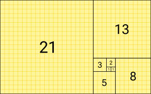
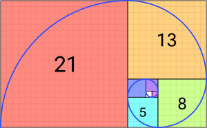

# 509 Fibonacci Number

0, 1, 1, 2, 3, 5, 8, 13, 21, 34, 55, 89, 144







The Fibonacci numbers may be defined by the recurrence relation

$F_0 = 0, F_1 = 1, and \ F_n = F_{n-1} + F_{n-2} \ for \ n>1$


## Example problem: Fibonacci sequence (LeetCode 509)

Get the Kth number in the Fibonacci Sequence. (K is 0-indexed, the 0th Fibonacci number is 0 and the 1st Fibonacci number is 1).

**Examples**

- 0th fibonacci number is 0
- 1st fibonacci number is 1
- 2nd fibonacci number is 1
- 3rd fibonacci number is 2
- 6th fibonacci number is 8

**Corner Cases**

- What if K < 0? in this case, we should always return 0.
- Is it possible the result fibonacci number is overflowed? We can assume it will not be overflowed when we solve this problem on this online judge, but we should also know that it is possible to get an overflowed number, and sometimes we will need to use something like BigInteger.

-----

Base case: F(0) = 0; F(1) = 1

Recursive rule: F(n) = F(n-1) + F(n-2)

```java
public class Fibonacci {
    public static void main(String[] args){
        System.out.println(fibo(4));
    }

    public static int fibo(int n){
    // Base case. (进入function之后首先check是否要停下)
        if (n == 0) {
            return 0;
        } else if (n == 1){
            return 1;
        } else {
            return fibo(n-1)+fibo(n-2);     // Recursive rule
        }
    }
}
```

```
3

Process finished with exit code 0
```


**Call Stack**: can be regarded as a global accessible information that tells you what happened before each **$\textcolor{Magenta}{break}$** point in each level

**Example Step by Step**

CallStack:           level == 1, local information: n == 4

​							level == 2, local information: n == 3

​							level == 3, local information: n == 2

​                            level == 4, local information: n == 1


​						      $\textcolor{Magenta}{F(4) \ \  \ \ \   \  \ 	        n = 4}$                          O(1)        2^0

​							   /                         \   

​                          $\textcolor{Magenta}{F(3)}$     bpLine07    + F(2)                  O(2)        2^1

​                           /      \							  /   \

​                   $\textcolor{Magenta}{F(2)}$  bpL + F(1)               F(1) + F(0)		 O(4)         2^2

​                   / \

​            $\textcolor{Magenta}{F(1)+F(0)}$ 													  .....        2^(n-1)

​            /            \

   return 1      return 2

Time = $O(1+2 +4+ ... 2^{(n-1)}) == O(2^n)$

1+2 +4+16+ ...+ 2^(n-1) -> 2^(n-1) // the last factor is dominant

Space complexity = O(n)   = stack + heap = (n=level) + 0 = n


**How to analyze time and space complexity of a recursive function**

* Time complexity: the sum of time complexity of all nodes in the recursion tree
* Space complexity: the sum of space complexity of all nodes on a pink path (a path from top to bottom)

中文翻译

* Recursion tree里<span style= "color:red">**所有节点**的**时间复杂度**之**和** </span>
* Recursion tree里一条$\textcolor{Magenta}{直上直下的粉色路径}$上**所有节点**的**空间复杂度**之**和**


<span style= "color:red">**常见错误（不要犯以下错误）**</span>

* Recursive function的时间复杂度等于recursion tree里节点的总个数？// 桃的质量不一定一样
* Recursive function的时间复杂度等于最后一层节点的个数？// 桃的质量不一定一样
* Recursive function的时间复杂度等于最后一层节点的时间复杂度之和？// 桃的质量不一定一样
* Recursive function的空间复杂度等于recursion tree的层数或者高度？// 只算了call stack 没有算heap
* Recursive function的空间复杂度等于所有节点的空间复杂度之和？


## Iteration

See the method 2

## Dynamic 

See the method 3


## ==Matrix Exponentiation==

See the method 4

Use Matrix Exponentiation to get the Fibonacci number from the element at (0, 0) in the resultant matrix.

In order to do this we can rely on the matrix equation for the Fibonacci sequence, to find the `Nth` Fibonacci number: 
$$
\begin{pmatrix}
0& 1 \\
1& 1 \\
\end{pmatrix}^n = 
\begin{pmatrix}
F_{(n-1)} & F_{(n)} \\
F_{(n)} & F_{(n+1)}
\end{pmatrix}
$$
This is a formula from matrix, just treat it like some math knowledge. You can direct use it.

Math:
$$
F_{(n)} = aF_{(n-1)} + bF_{(n-2)} \\
\text{for } \ n \geq 2, \text{ and }
a,b,c \text{ are constants.}
$$

$$
\begin{align*}
&A  = \begin{pmatrix}
0 & 1\\
1 & 1\\
\end{pmatrix}\\
&A^2 = \begin{pmatrix}
0 & 1\\
1 & 1\\
\end{pmatrix}
\begin{pmatrix}
0 & 1 \\
1 & 1 \\
\end{pmatrix} = 
\begin{pmatrix}
0 \times 0 +1\times 1 & 0\times 1+1 \times 1 \\
1 \times 0+1 \times 1 & 1 \times 1 + 1 \times 1 
\end{pmatrix} =
\begin{pmatrix}
1 & 1\\
1 & 2 \\
\end{pmatrix} \\
& A^3 = A^2\times A =
\begin{pmatrix}
1 & 1 \\
1 & 2
\end{pmatrix}
\begin{pmatrix}
0 & 1 \\
1 & 1 \\
\end{pmatrix}=
\begin{pmatrix}
1 & 2 \\
2 & 3
\end{pmatrix}\\
& A^4 = \begin{pmatrix}
1 & 2 \\
2 & 3 \\
\end{pmatrix}
\begin{pmatrix}
0 & 1 \\
1 & 1 \\
\end{pmatrix} = 
\begin{pmatrix}
2 & 3\\
3 & 4 
\end{pmatrix}\\
& \dots \\
& \text{Assume}, A^n = 
\begin{pmatrix} 
F_{(n-1)} &  F_{(n)}\\
F_{(n)} & F_{(n+1)}
\end{pmatrix}\\
& \text{Mathematical Induction:}\\
& \text{Suppose it is true when } n = k, \text{ i.e. } 
A^k = 
\begin{pmatrix}
F_{(n-1)} & F_{(n)}\\
F_{(n)} & F_{(n+1)}
\end{pmatrix}\\
& \therefore \text{ when } n = k + 1 \\
& A^{k+1} = A^k \cdot A = \begin{pmatrix}
F_{(n-1)} & F_{(n)}\\
F_{(n)} & F_{(n+1)}
\end{pmatrix}
\begin{pmatrix}
0 & 1 \\
1 & 1 \\
\end{pmatrix} = 
\begin{pmatrix}
F_{(n)} & F_{(n+1)}\\
F_{(n+1)} & F_{(n+2)}
\end{pmatrix}\\
&\therefore 
A^n = \begin{pmatrix}
F_{(n-1)} & F_{(n)} \\
F_{(n)} & F_{(n+1)}
\end{pmatrix}
\end{align*}
$$


Algorithm:

* Check if `N` is less than or equal to 1. If it is, return `N`.
* Use a recursive function, `matrixPower`, to calculate the power of a given matrix `A`. The power will be `N-1` , where `N` is the `Nth` Fibonacci number.
* The `matrixPower` function will be performed for `N/2` of the Fibonacci numbers.
* Within `matrixPower`, call the `multiply` function to multiply 2 matrices.
* Once we finish doing the calculations, return `A[0][0]` to get the `Nth` Fibonacci number.


## ==Math==

See the method 5

Let's use the `golden ratio`, a.k.a `Binet's formula`: $\varphi = \frac{1+\sqrt(5)}{2}\approx 1.6180339887....$

Here's a [link](http://demonstrations.wolfram.com/GeneralizedFibonacciSequenceAndTheGoldenRatio/) to find out more about how the Fibonacci sequence and the golden ratio work.

We can derive the most efficient solution to this problem using only constant space!

Fibonacci sequence

$F_n: 0, 1, 1, 2, 3, 5, 8, 13, 21, 34, ...$

$\phi_8 = \frac{F_8}{F_7} = 1.$6190476190476190476


Generalized Fibonacci sequence

$G_n: a, b, a+b, a + 2b, 2a + 3b, 3a + 5b, 5a + 8b, 8a+13b, \dots \\ =3.5, 5.3, 8.8, 14.1, 22.9, 37, 59.9, 96.9,...$

$\Phi = \frac{G_8}{G_7} = 1.6179846938775510204$


$$
\begin{align*}
& F_{(n)} = F_{(n-1)} + F_{(n-2)} \\
& \frac{F_{(n)}}{F_{(n-1)}} = 1 + \frac{F_{(n-2)}}{F_{(n-1)}} \\
& \phi = \lim_{n \rightarrow \infin}\frac{F_{(n)}}{F_{(n-1)}} \\
& \therefore \frac{F_{(n-2)}}{F_{(n-1)}}= \frac{1}{\phi}\\
& \therefore \phi =  1 + \frac{1}{\phi} \\
& \therefore \phi = \frac{1\pm\sqrt{(5)}}{2} \\
& \therefore \text{the positive root } \phi = \frac{1+\sqrt{(5)}}{2} \approx 1.6180339887....\\
& \therefore F_{(n)} = \frac{1 + \phi}{F_{n-1}}\\
& \text{For the generalized Fibonacci sequence }G: a, b, a+b, a + 2b, 2a + 3b, 3a + 5b, 5a + 8b, 8a+13b, \dots \\ 
& G_n = aF_{(n)} +bF_{(n+1)}
\end{align*}
$$
Binet's formula to expanded Fibonacci sequence:
$$
F_n = \frac{(\frac{1+\sqrt{5}}{2})^n - (\frac{1-\sqrt{5}}{2})^n}{\sqrt{5}}
$$
If you know the formula, just can use it. 

```java
/* Get the Kth number in the Fibonacci Sequence. (K is 0-indexed,
 * the 0th Fibonacci number is 0 and the 1st Fibonacci number is 1
 * 0th fibonacci number is 0;
 * 1st fibonacci number is 1;
 * 2nd fibonacci number is 1;
 * 3rd fibonacci number is 2;
 * 6th fibonacci number is 8;
 * What if K < 0? in this case, we should always return 0.
Is it possible the result fibonacci number is overflowed? We can assume it will not be overflowed when we solve this problem on this online judge, but we should also know that it is possible to get an overflowed number, and sometimes we will need to use something like BigInteger.
 *
 *
 */
import java.lang.Math.*;
public class FibonacciNumberLite624{
	public static void main(String[] args){
		int x0 = 0;
		int x1 = 1;
		int x2 = 2;
		int x3 = 3;
		int x4 = 6;
		System.out.println("Method 1:");
		System.out.println(fibo(x0));
		System.out.println(fibo(x1));
		System.out.println(fibo(x2));
		System.out.println(fibo(x3));
		System.out.println(fibo(x4));

		System.out.println("Method 2:");
		System.out.println(fibo2(x0));
		System.out.println(fibo2(x1));
		System.out.println(fibo2(x2));
		System.out.println(fibo2(x3));
		System.out.println(fibo2(x4));

		System.out.println("Method 3:");
		System.out.println(fibo3(x0));
		System.out.println(fibo3(x1));
		System.out.println(fibo3(x2));
		System.out.println(fibo3(x3));
		System.out.println(fibo3(x4));

		System.out.println("Method 4:");
 		System.out.println(fibo4(x0));
		System.out.println(fibo4(x1));
		System.out.println(fibo4(x2));
		System.out.println(fibo4(x3));
		System.out.println(fibo4(x4));

		System.out.println("Method 5:");
                System.out.println(fibo5(x0));
		System.out.println(fibo5(x1));
		System.out.println(fibo5(x2));
		System.out.println(fibo5(x3));
		System.out.println(fibo5(x4));

	}

	public static int fibo(int x){
		// base case
		if (x == 0){
			return 0;
		}else if (x == 1){
			return 1;
		}
		// recursive rule		
		int f = fibo(x-1) + fibo(x-2);
		return f;
	}
	/* Time complexity = 2^0 + 2^1 + 2^2 + ... + 2^(n-1) = 2^n
	 * Space complexity = stack + heap = n level  + 0 = n
	 * TC: 2^n
	 * SC: n
	 * */

	

	public static int fibo2(int x){
		// base case
		if (x == 0){
			return 0;
		} else if (x == 1){
			return 1;
		}

		int[] rem = new int[x + 1];
		rem[0] = 0;
		rem[1] = 1;

		// iterative 
		for (int i = 2; i <= x; i++){
			rem[i] = rem[i-1] + rem[i-2];
		}

		return rem[x];
	}

	/* Time complexity = O(n);
	 * Space complexity = O(n);
	 */

	public static int fibo3(int x){
		// base case
		int start = 0;
		int first = 1;

		if (x == 0){
			return start;
		}else if (x == 1){
			return first;
		}

		int last = first;
		int lastlast = start;
		int f = 0;

		for (int i = 2; i <= x; i++){
			f = last + lastlast;
			lastlast = last;
			last = f;
		}
		return f;
	}
	/* Time complexity = O(n);
	 * Space complexity = O(1);
	 */
	
	/* use matrix */
	public static int fibo4(int x){
		int f0 = 0;
		int f1 = 1;
		if (x == 0){
			return f0;
		}else if (x == 1){
			return f1;
		}

		int[][] A = new int[][]{{0,1},{1,1}};
		matrixPower(A, x-1);

		return A[1][1];
		
	}

	public static void matrixPower(int[][] A, int n){
		if (n == 0 || n == 1){
			return;
		}
		           
		matrixPower(A, n/2); 
		multiply(A, A);

		int[][] B = new int[][]{{0,1},{1,1}};
		if (n % 2 != 0) {
			multiply(A,B);
		}
	}

	public static void multiply(int[][] A, int[][] B){
		int x = A[0][0] * B[0][0] + A[0][1] * B[1][0];
		int y = A[0][0] * B[0][1] + A[0][1] * B[1][1];
		int j = A[1][0] * B[0][0] + A[1][1] * B[1][0];
		int k = A[1][0] * B[0][1] + A[1][1] * B[1][1];

		A[0][0] = x;
		A[0][1] = y;
		A[1][0] = j;
		A[1][1] = k;
	
	
	}
	/* Time complexity: O(logn). By halving the N value in every
	 * matrixPower 's call to itself, we are halving the work need to be done.
	 *
	 * Space complexity: O(logn). The size of the stack in memory is 
	 * proportional to the function calls to matrixPower plus the memory used
	 * to account for the matrices which use constant space.
	 */


	public static int fibo5(int x){
		// base case 
		if (x == 0){
			return 0;
		}else if (x == 1){
			return 1;
		}

		double goldenRatio = (1 + Math.sqrt(5))/2;
		int f = (int) Math.round(Math.pow(goldenRatio,x) /Math.sqrt(5));
		return f;
			
	}
	/* Time complexity: O(logN) We do not use loops or recursion, so the time
	 * required equals the time spent performing the calcuation using `Binet's
	 * formula`. However, raising the `golden_ratio` to the power of N requires
	 * O(logN) time.
	 *
	 * Space complexity: O(1). The space used is the space needed to create the 
	 * variable to store the `golden ratio`.
	 */

}

```

