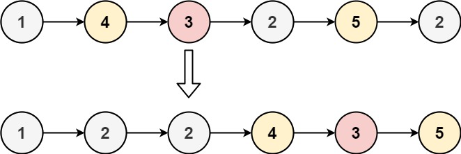

# 86 Partition List

Given the `head` of a linked list and a value `x`, partition it such that all nodes **less than** `x` come before nodes **greater than or equal** to `x`.

You should **preserve** the original relative order of the nodes in each of the two partitions.

 

**Example 1:**



```
Input: head = [1,4,3,2,5,2], x = 3
Output: [1,2,2,4,3,5]
```

**Example 2:**

```
Input: head = [2,1], x = 2
Output: [1,2]
```


```java
/**
 * Definition for singly-linked list.
 * public class ListNode {
 *     int val;
 *     ListNode next;
 *     ListNode() {}
 *     ListNode(int val) { this.val = val; }
 *     ListNode(int val, ListNode next) { this.val = val; this.next = next; }
 * }
 */
class Solution {
    public ListNode partition(ListNode head, int x) {
        // base case 
        if (head == null){
            return head;
        }

        ListNode small = new ListNode(-1);
        ListNode cursmall = small;
        ListNode le = new ListNode(-1); // >=
        ListNode curle = le;
        ListNode cur = head;
        ListNode next = null;

        while (cur != null){
            next = cur.next;
            cur.next = null;
            if (cur.val < x){
                cursmall.next = cur;
                cur = next;
                cursmall = cursmall.next;
            }else{ // >=
                curle.next = cur;
                cur = next;
                curle = curle.next;
            }
        }

        cursmall.next = le.next;
        return small.next; 
    }
}

// TC: O(n)
// SC: O(1)

/* 

       <  x >= 

       1 -> 4. 3 2 5 2
           cur
        

        [smaller]   
          1  2 2
                            [largerandequal]
                             4 3 5
          
      return  smalleer + largerandequal

*
```


Can draw  picture will be better.

