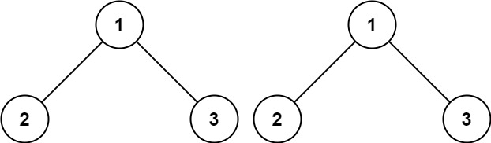
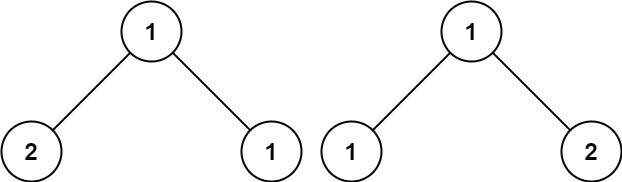

# 100 Same Tree

Given the roots of two binary trees `p` and `q`, write a function to check if they are the same or not.

Two binary trees are considered the same if they are structurally identical, and the nodes have the same value.

 

**Example 1:**



```
Input: p = [1,2,3], q = [1,2,3]
Output: true
```

**Example 2:**


```
Input: p = [1,2], q = [1,null,2]
Output: false
```

**Example 3:**



```
Input: p = [1,2,1], q = [1,1,2]
Output: false
```


```java
/**
 * Definition for a binary tree node.
 * public class TreeNode {
 *     int val;
 *     TreeNode left;
 *     TreeNode right;
 *     TreeNode() {}
 *     TreeNode(int val) { this.val = val; }
 *     TreeNode(int val, TreeNode left, TreeNode right) {
 *         this.val = val;
 *         this.left = left;
 *         this.right = right;
 *     }
 * }
 */
class Solution {
    public boolean isSameTree(TreeNode p, TreeNode q) {
        // base case 
        if (p == null && q == null){
            return true;
        }

        if (p != null && q == null){
            return false;
        }

        if (p == null && q != null){
            return false;
        }

        // p q !=null

        if (p.val != q.val){
            return false;
        }

        return isSameTree(p.left, q.left) && isSameTree(p.right, q.right);
    }
}
```


**Complexity Analysis**

- Time complexity : O(N)
  where N is a number of nodes in the tree, since one visits each node exactly once.
- Space complexity : O(N) in the worst case of completely unbalanced tree, to keep a recursion stack.