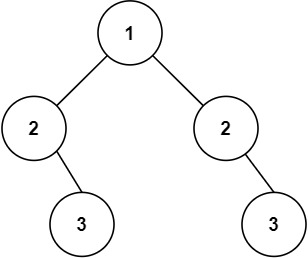

# 101 Symmetric Tree

Given the `root` of a binary tree, *check whether it is a mirror of itself* (i.e., symmetric around its center).

 

**Example 1:**


```
Input: root = [1,2,2,3,4,4,3]
Output: true
```

**Example 2:**



```
Input: root = [1,2,2,null,3,null,3]
Output: false
```


```java
/**
 * Definition for a binary tree node.
 * public class TreeNode {
 *     int val;
 *     TreeNode left;
 *     TreeNode right;
 *     TreeNode() {}
 *     TreeNode(int val) { this.val = val; }
 *     TreeNode(int val, TreeNode left, TreeNode right) {
 *         this.val = val;
 *         this.left = left;
 *         this.right = right;
 *     }
 * }
 */
class Solution {
    public boolean isSymmetric(TreeNode root) {
        // base case 
        if (root == null){
            return true;
        }
        
        return helper(root.left, root.right);
    }

    private static boolean helper(TreeNode left, TreeNode right){
        if (left == null && right == null){
            return true;
        }

        if (left == null && right != null){
            return false;
        }

        if (left != null && right == null){
            return false;
        }

        // left  != null && right != null
        if (left.val != right.val){
            return false;
        }

        return (helper(left.left, right.right) && helper(left.right, right.left));
    }
}


/*

    root not worry it

    left , right 

    case 1  left= null  right=null is true
    case 2  left = null right !=null is false
    case 3  left != null right = null is false
    case 4  => left && right != null 
                if left.val != right.val return false
    

          left.left, right.right   &&   left.right right.left.
     

*/
```

**Complexity Analysis**

- Time complexity : O(n)O(n)*O*(*n*). Because we traverse the entire input tree once, the total run time is O(n)O(n)*O*(*n*), where nn*n* is the total number of nodes in the tree.
- Space complexity : The number of recursive calls is bound by the height of the tree. In the worst case, the tree is linear and the height is in O(n)O(n)*O*(*n*). Therefore, space complexity due to recursive calls on the stack is O(n)O(n)*O*(*n*) in the worst case.