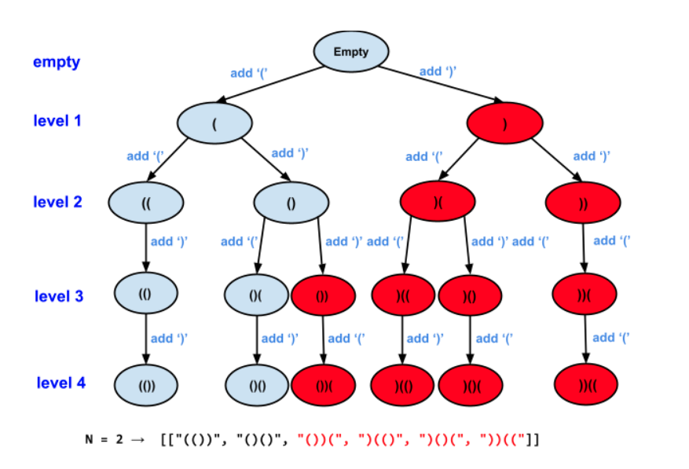
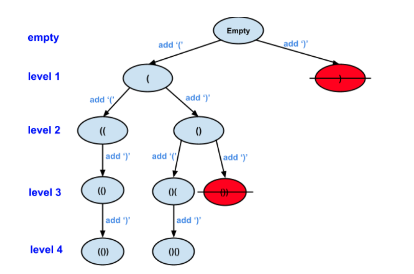

# 22 Generate Parentheses

Given `n` pairs of parentheses, write a function to *generate all combinations of well-formed parentheses*.

 

**Example 1:**

```
Input: n = 3
Output: ["((()))","(()())","(())()","()(())","()()()"]
```

**Example 2:**

```
Input: n = 1
Output: ["()"]
```

 

```java
class Solution {
    public List<String> generateParenthesis(int n) {
        List<String> result = new ArrayList<String>();
        if (n <= 0){
            return result;
        }

        StringBuilder sb = new StringBuilder();
        int left = 0;
        int right = 0;
        helper(n, left, right, sb, result);
        return result;
    }

    private static void helper(int n, int left, int right,StringBuilder sb, List<String> result){
        if (left == n && right == n){
            result.add(sb.toString());
            return;
        }

        // case 1. Add "(" 只要还有就能加
        if (left < n){
            sb.append('(');
            helper(n, left + 1, right, sb, result);
            sb.deleteCharAt(sb.length() - 1);
        }


         // case 2. Add ")" 加过左的 比 右加的多

         if (left > right){
             sb.append(')');
             helper(n, left, right+1, sb, result);
             sb.deleteCharAt(sb.length()-1);
         }
    }
}

//TC: O(n2^(2n))

// SC: O(2n)
```


## DFS 经典例题2 () () () find all valid permutation using the parenthesis provided.


观察所有解决:

N = 2 -> [["( ( ) )", "( )( )"]]									all valid permutation

Question 0: 这个N = 2 的所有可能解吗? if all, should be 6 ?

N = 2 -> [["( ( ) )", "( ) ( )", ~~" ( ) ) ( ", ") ( ( ) ", ") ( ) (", ") ) ( ( "~~]]


什么是Valid? 

whenever we want to add a right parentheses, there must be a open left parentheses.

we need to know how many left we have already added so for -> 已经加过多少个左括号

​								how many right we have alread added so for -> 已经加过多少个右括号

leftAddedSofar = 0                           	rightAddedSoFar = 0


**Question 1: 什么是Permutation?**

1. 顺序matter吗?			Yes
2. 能不加吗?                不能不加

permutation: 

 [,pə:mju:'teiʃən] 

n. [数] 排列；[数] 置换:

1. output 顺序
2. 不能不选


Method 1: 无脑添加

只要还有剩余的括号就加

Bad Recursion Tree:



N = 2 -> [["( ( ) )", "( ) ( )", ~~" ( ) ) ( ", ") ( ( ) ", ") ( ) (", ") ) ( ( "~~]]

上来就加一个")", 后面就全错了


Method: 如何能人为的避免产生不合法的括号组会呢?

思考什么时候能添加左括号?

​		其实没有限制, 只要还有剩余的可加就可以直接加

思考什么时候能添加右括号?

​		不是只要还有剩余就能加,


N = 3 	 leftcount  已经加了0个left,								rightcount已经加了 0个right

​				leftcount = 1 												 	rightcount = 1

​                ( )      可以加左     ()    + (         不能加 右

​				

​		 leftcount = 2													 rightcount =1

​              (( )     可以加左      (( )      + (         能加右


总结: 

leftcount = rightcount      不能加右

leftcount < rightcount      不能加右


每一层: 加一个括号

branch: add left or add right

level:  2*N 层


N = 2     2left 2right

​																		[ ] empty      0 : 0

​																	/

第一层: 												(     (1 : 0)

​																/           \  

第二层:											(( (2:0)          ()   (1:1)

​												             |					  |

第三层					      没左了         (() (2: 1)              ()(  (2: 1)		

​															|						|

第四层												(())         			()()


正确的Recursion Tree

N = 2 -> [["( ( ) )", "( ) ( )", ~~" ( ) ) ( ", ") ( ( ) ", ") ( ) (", ") ) ( ( "~~]]				

Restriction: number of "(" added so far > ")" added so far												


branch = 2 要么加左 要么加右

level: 2*n

Time: O(2^(2n))           n对括号

Space: O(2n)


减枝 = pruning 我知道不合法的Node我就不去

we need to know how many left have already added so for => 已经加过多少个左括号

​								how many right we have already added so for => 已经加过多少个右括号

总结: N对儿 括号=> 2N个括号

​		加左的条件: 有左就可以有右

​		加右的条件: 加过的左括号数量 > 加过的右括号数量

加过的左括号数量: leftAddedSoFar

加过的右括号数量: rightAddedSoFar

```java
// n stores total number of "pair of ()" need to add. So total levels == 2*n
// l stores the number of left parenthesis "(" added so far.
// r stores the number of right parenthesis ")" added so far.
// soluPrefix: solution so far
		//一开始传						0							0
		// 									 |						 |
void DFS(int n, int leftcount, int rightcount, StringBuilder soluPrefix){
  if (leftcount == n && rightcount == n){   // 所有的括号都加满了
    System.out.println(soluPrefix); // base case
  }
  
  // Case1: add '(' on this level
  if (leftcount < n){          // 左还有的可加的时候
    soluPrefix.append('(');
    DFS(n, leftcount + 1, rightcount, soluPrefix);  // 下一个子节点
    soluPrefix.deleteCharAt(soluPrefix.length() - 1);   //  回到当前层 再去另外一个分支
  }
  
  // Case2: add ')' on this level
  if (leftcount > rightcount){   
    soluPrefix.append(')');
    DFS(n, leftcount, rightcount + 1, soluPrefix);
    soluPrefix.deleteCharAt(soluPrefix.length() - 1);  // 
  }
}
```

DFS 一定要画recursion tree

教案上 Time = O(2^(2n) *n ) 为什么乘n  因为这里涵盖的打印的时间 O(n)

​             Time: O(2^n* n)            2的n次方乘不乘n差距没有那么大了 都是一个量级


如果我告诉你Recursion Tree里面有m个Branch n层:  Time = branch ^ level)

Time: O(2^n)

