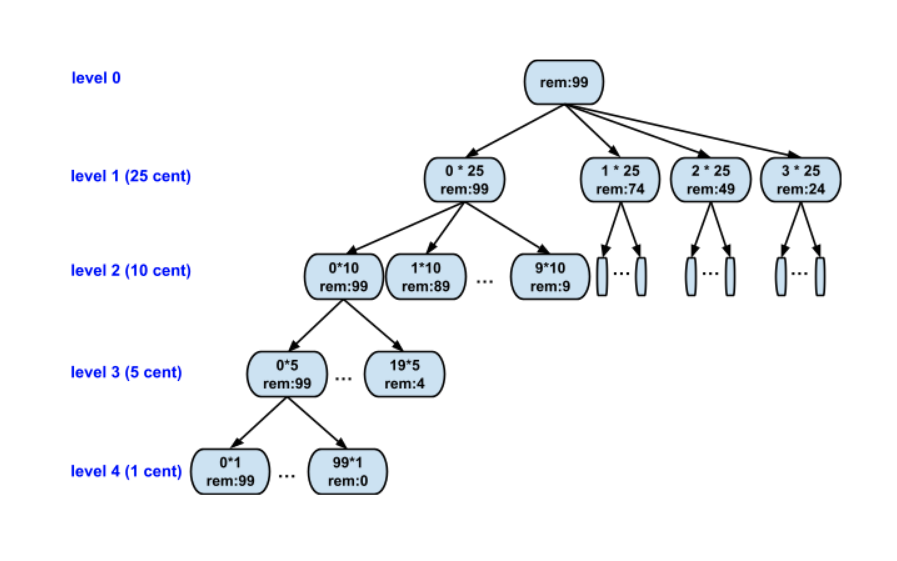

# 39 Combination Sum

Given an array of **distinct** integers `candidates` and a target integer `target`, return *a list of all **unique combinations** of* `candidates` *where the chosen numbers sum to* `target`*.* You may return the combinations in **any order**.

The **same** number may be chosen from `candidates` an **unlimited number of times**. Two combinations are unique if the 

frequency

 of at least one of the chosen numbers is different.


The test cases are generated such that the number of unique combinations that sum up to `target` is less than `150` combinations for the given input.

 

**Example 1:**

```
Input: candidates = [2,3,6,7], target = 7
Output: [[2,2,3],[7]]
Explanation:
2 and 3 are candidates, and 2 + 2 + 3 = 7. Note that 2 can be used multiple times.
7 is a candidate, and 7 = 7.
These are the only two combinations.
```

**Example 2:**

```
Input: candidates = [2,3,5], target = 8
Output: [[2,2,2,2],[2,3,3],[3,5]]
```

**Example 3:**

```
Input: candidates = [2], target = 1
Output: []
```


```java
class Solution {
    public List<List<Integer>> combinationSum(int[] candidates, int target) {
        List<List<Integer>> result = new ArrayList<List<Integer>>();
        if (candidates == null || candidates.length == 0){
            return result;
        }
        List<Integer> subresult = new ArrayList<Integer>();
        helper(candidates, target, 0, subresult, result);

        return result;
    }


    private static void helper(int[] candidates, int targetLeft, int index, List<Integer> subresult, List<List<Integer>> result){
        if (index == candidates.length){
            if (targetLeft == 0){
                result.add(new ArrayList(subresult));
            }
            return;
        }
        
        int MaxNumber = targetLeft / candidates[index];
        for (int i = 0; i <= MaxNumber; i++){
            for (int j = 0; j < i; j++){
                subresult.add(candidates[index]);
            }
            helper(candidates, targetLeft - i * candidates[index], index + 1, subresult, result);


            for (int j = 0; j < i; j++){
                subresult.remove(subresult.size()-1);
            }
        }
    }

}


/*

level: only think about one candidates

branch:       

level                        7
                           / \  \       \     
0                   2*0      2*1   2*2   2*3
                 /   \   \
1               3*0  3*1  3*2


*/
```

**Complexity Analysis**

Let NN*N* be the number of candidates, TT*T* be the target value, and MM*M* be the minimal value among the candidates.

- Time Complexity: O(NTM+1)\mathcal{O}(N^{\frac{T}{M}+1})O(*N**M**T*+1)
  - As we illustrated before, the execution of the backtracking is unfolded as a DFS traversal in a n-ary tree.
    The total number of steps during the backtracking would be the number of nodes in the tree.
  - At each node, it takes a constant time to process, except the leaf nodes which could take a linear time to make a copy of combination. So we can say that the time complexity is linear to the number of nodes of the execution tree.
  - Here we provide a *loose* upper bound on the number of nodes.
    - First of all, the fan-out of each node would be bounded to NN*N*, *i.e.* the total number of candidates.
    - The maximal depth of the tree, would be TM\frac{T}{M}*M**T*, where we keep on adding the smallest element to the combination.
    - As we know, the maximal number of nodes in N-ary tree of TM\frac{T}{M}*M**T* height would be NTM+1N^{\frac{T}{M}+1}*N**M**T*+1.
  - **Note that**, the actual number of nodes in the execution tree would be much smaller than the upper bound, since the fan-out of the nodes are decreasing level by level.
- Space Complexity: O(TM)\mathcal{O}(\frac{T}{M})O(*M**T*)
  - We implement the algorithm in recursion, which consumes some additional memory in the function call stack.
  - The number of recursive calls can pile up to TM\frac{T}{M}*M**T*, where we keep on adding the smallest element to the combination.
    As a result, the space overhead of the recursion is O(TM)\mathcal{O}(\frac{T}{M})O(*M**T*​).
  - In addition, we keep a combination of numbers during the execution, which requires at most O(TM)\mathcal{O}(\frac{T}{M})O(*M**T*) space as well.
  - To sum up, the total space complexity of the algorithm would be O(TM)\mathcal{O}(\frac{T}{M})O(*M**T*).
  - Note that, we did not take into the account the space used to hold the final results for the space complexity.


### DFS 经典例题3 Print all combinations of coins that can sum up to a total value n.

73. Combinations Of Coins

Given a number of different denominations of coins (e.g., 1 cent, 5 cents, 10 cents, 25 cents), get all the possible ways to pay a target number of cents.

**Arguments**

- coins - an array of positive integers representing the different denominations of coins, there are no duplicate numbers and the numbers are sorted by descending order, eg. {25, 10, 5, 2, 1}
- target - a non-negative integer representing the target number of cents, eg. 99

**Assumptions**

- coins is not null and is not empty, all the numbers in coins are positive
- target >= 0
- You have infinite number of coins for each of the denominations, you can pick any number of the coins.

**Return**

- a list of ways of combinations of coins to sum up to be target.
- each way of combinations is represented by list of integer, the number at each index means the number of coins used for the denomination at corresponding index.

**Examples**

coins = {2, 1}, target = 4, the return should be

[

 [0, 4],  (4 cents can be conducted by 0 * 2 cents + 4 * 1 cents)

 [1, 2],  (4 cents can be conducted by 1 * 2 cents + 2 * 1 cents)

 [2, 0]   (4 cents can be conducted by 2 * 2 cents + 0 * 1 cents)

]


E.g. total value n = 99 cents

coin value(币值) = 25 10 5 1 cent

one possible way:

3 * 25 = 75 cents						75

2*10 = 20 cents 						 95

0* 5 = 0 cents							 95

4 * 1 = 4 cents							99


[25, 10, 5, 1]

[3, 2, 0, 4]						OK

[0, 0, 0, 99]					  also OK


DFS基本方法:

1. what does it store on each level? (每层代表什么意义? 一般来讲解题之前就知道DF要recurse多少层)

   每一层  选一个coin     

   最多多少层: 99

2. How many different states should we try to put on this level? (每层有多少个状态/ case 需要try?) 

   4 branches     有几个硬币有几个分支


Method 1 : 对的, 但是不那么好

target = 99

​																	target = 99

​							/ 25							 /10 						\ 5									\1

level 0			25(rem = 74)			 10(rem=89)			  5(rem = 94)				  4(rem = 98)   

​						/			|		\		\

level 1          25(49)  10(64) 5(69)  1(73)            ....


......

level 99          1 (rem = 0)


branch = 4 

level = 99

Time = O( 4^99)

Space = O(99)    // 容易爆栈了

   

   

有重复


如何去掉重复, 压缩层数

99->98->97->96 -> ..... 1


Solution: 


每一层只考虑一种硬币

分支: 拿几个

 

​																			target = 99

​													/ 0     			     |1              	         |2    				    \ 3

level 0: 25							99						  74							49							24

​							/0   /1  /2  /3 |4|5 |6|7  \8 \9

level 1: 10        							

level 2: 

level 3:

层数 = 硬币的种类数

branch: 99

level: 44




Time: O(99^4)

Space: O(4)


​										Solution 1												vs                           Solution 2

Time:							O(4 ^ 99)												>								O(99^4)

Space:						level is not decided before running 										level is always 4

Deduplication:			need to worry																			worry-free


```java
void findCombianation(int[] coins, int moneyLeft, int index, int[] sol){
  if (index == 3){
    sol[index] = moneyLeft;
    print sol..
    return;
  }
  // 对于这一层要考虑的硬币 coins[index]最多能拿多少
  // i 代表我们拿了几个 coins[index]
  for (int i = 0; i <= maxWeCanTakeAtThisLevel; i++){
    sol[index] = i;
    findCombianation(coins, moneyLeft - i*coins[index], index +1,sol)
    sol[index] = 0;
  }
}
```

​						初始:	   [0,  0, 0 , 0]

​										[25, 10, 5, 1]		remain Target			level第几层: 告诉你当前层正在考虑哪儿个硬币

​													|						|							|

```java
void findCombination(int[] coin, int moneyLeft, int index, int[] sol){
  if (index == 3){ // 必须建立在最后为1 直接掉过最后一层
    sol[index] = moneyLeft;
    print solution and return
  }
  // money value on this level == coin[index];
  // branch的含义: 这种硬币选几个
  // 这一层是哪儿种硬币 coins[index]
  // 最多选: moneyLeft/coins[index]
  // i: 这一次尝试选了i个, 
  for (int i = 0; i <= moneyLeft / coin[index]; i++); {
    sol[index] = i;
    findCombination(coin, moneyLeft - i * coin[index], index + 1, sol);
    
    //sol[index] = 0; 吐
    
    // 这里的index 是下一次要考虑哪儿个硬币  index 是控制硬币种类.
  }
}
```


i 1 = 50 个1

solution[index] = 50 然后去下一层

findCombination()

//我应该把它还原成0

solution[index] = 0      // 为什么这行可以不写 因为可以覆盖掉


i 2 = 51

solution[index] = 51 