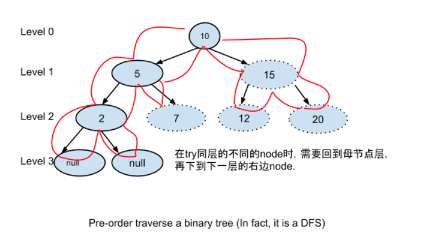
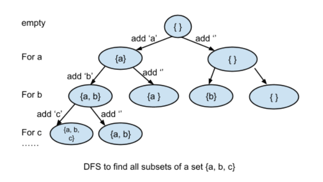
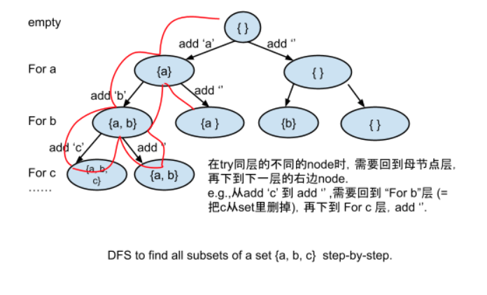
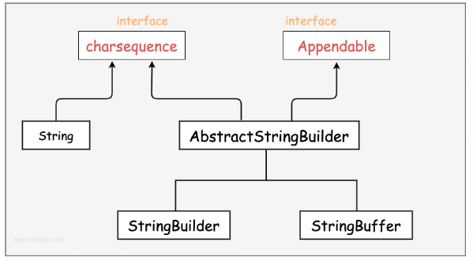
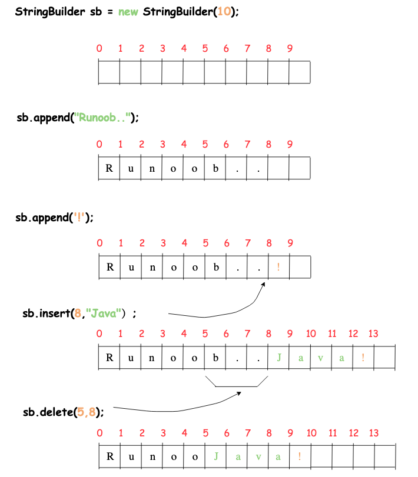
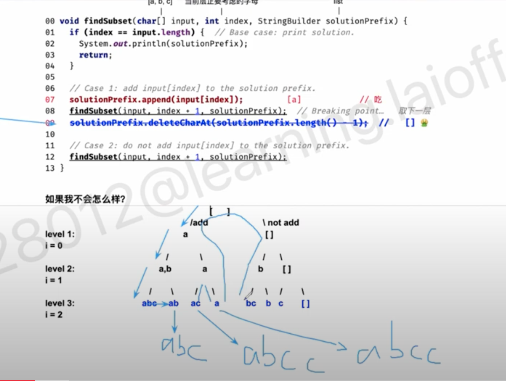
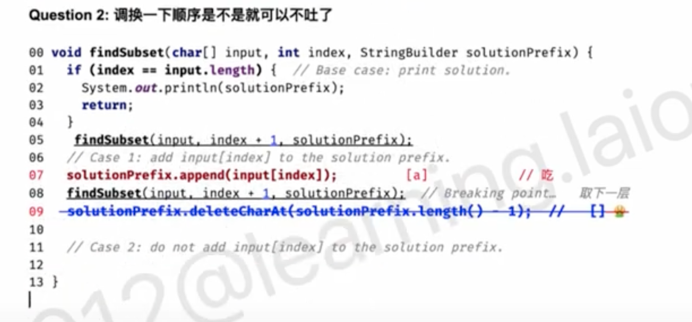
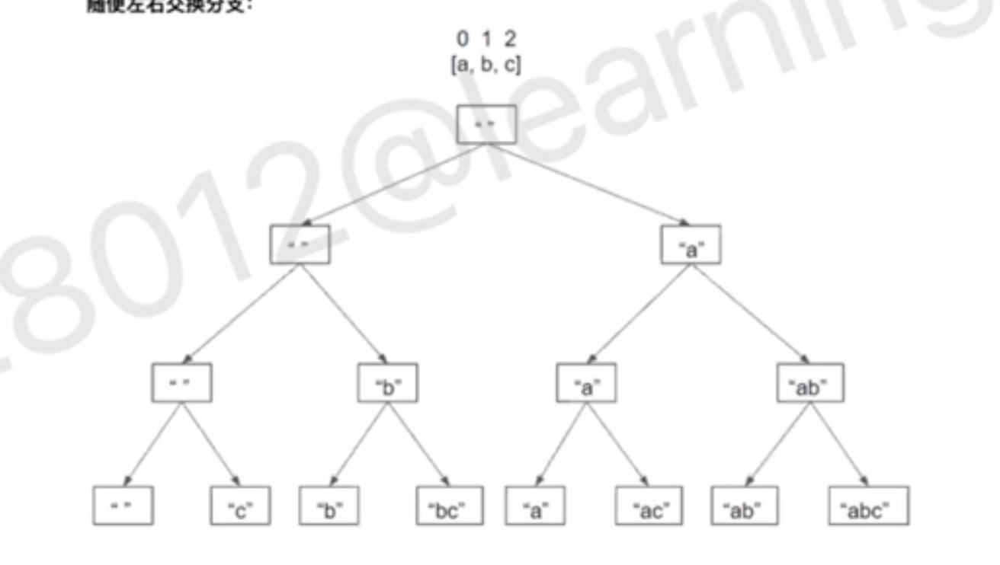
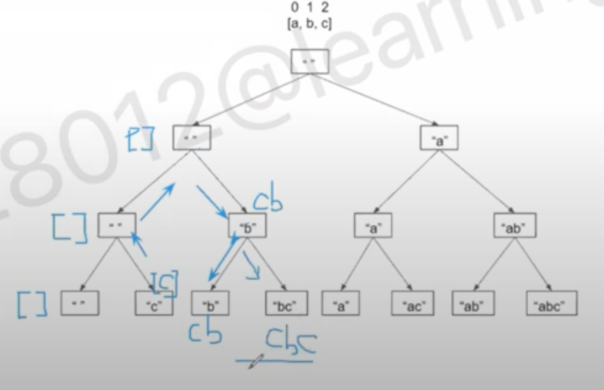

# 78 Subsets

Given an integer array `nums` of **unique** elements, return *all possible* *subsets* *(the power set)*.

The solution set **must not** contain duplicate subsets. Return the solution in **any order**.

**Example 1:**

```
Input: nums = [1,2,3]
Output: [[],[1],[2],[1,2],[3],[1,3],[2,3],[1,2,3]]
```

**Example 2:**

```
Input: nums = [0]
Output: [[],[0]]
```


```java
class Solution {
    public List<List<Integer>> subsets(int[] nums) {
        List<List<Integer>> result = new ArrayList<List<Integer>>();
        if (nums == null || nums.length == 0){
            return result;
        }

        List<Integer> subresult = new ArrayList<Integer>();
        helper(nums, 0, subresult, result);
        return result;
        
    }


    private static void helper(int[] array, int index, List<Integer> subresult, List<List<Integer>> result){
        if (index == array.length){
            result.add(new ArrayList(subresult));
            return;
        }
        // // Add current subset into final result
        // Java object is passing by refernce, so we have to make a copy here

        subresult.add(array[index]);
        // add 
        helper(array, index + 1, subresult, result);

        // delete
        subresult.remove(subresult.size()-1);

        helper(array, index + 1, subresult, result);

        // not add
    }
}


/*
helper (1, 2, 3)    

levels = the i the character wether add
                  1 2 3
            add /       \ not add
0            1           []   
            /  \         / \   
1          12   1       2   []  
           / \  / \    / \   /\     
2        123 12 13 1  23 2  3  []
 
*/

// TC: n*2^n
// a set with 
// N elements have 2^n subsets
// But the call stack goes to a maximum depth of O(N) so space should be O(N) atleast.
// SC: O(n)a
//pace complexity: O(N). We are using O(N) space to maintain curr, and are modifying curr in-place with backtracking. Note that for space complexity analysis, we do not count space that is only used for the purpose of returning output, so the output array is ignored.

```


First, let's recall the pre-order traverse the binary tree code

​											==10== == root

​										/		\

​									==5==			 15

​								/		\		/	\

​							 ==2==			7	12	20      <- all leaf node's level == 3

​							/ \ 

​						==null== null

Inorder(left, root, right)

preorder(root, left, right) : 10 5 2 7 15 12 20

postorder(left, right, root)


``` java
public void printTreePreOrder(Node root){
  if (root == null) {
    //base case
    return;
  }
  System.out.println(root.val);
  printTreePreOrder(root.left); // case1: try left first
  printTreePreOrder(root.mid);
  printTreePreOrder(root.right); // case2: try right then
}
```




难点在拐弯的地方比如level 3  中null 回到2 


上图所示，是难点，也是精髓

DFS：深度优先，它是一头扎到底


Recursion 	vs 	DFS (Search Algorithm)

DFS, in more general scope, it is one kind of search algorithm.

DFS can be implemented in an either **recursive way**, or in iterative way


面试里要是没有特定要求用recursive 是稳定对的


Back-tracking 回溯 从一个分支回到母节点

Back-tracking	 vs 	DFS

Back-tracking describes the behavior of DFS


今天讲

Depth-First Search (DFS):

* Recall "using pre-order to traverse a tree"
* 实现方法: easy to use recursion
* 常见考题:
  * DFS例题1: print **all** subsets of a set
  * DFS例题2: pritn **all** valid permutations of ( ) ( ) ( )
    * ( )( )( )	( ( ( ) ) )    (())( )
  * DFS 例题3: e.g.凑硬币99 cents
    * 有1分, 5 分, 10分, 25分coin, 给定一个钱数99cent, 有多少种组成方式, 并打印出所有的可能组合?
  * DFS一类的题目(too many to list all  - > 强化练习课)
    * 1. Given an input string =  "127222458", output all valid ip_address
         * 4 levels
    * 2. Permutation of a string (with/ without duplicate letters)
         * str.length levels
    * 3. Permulation of all subsequence of a sorted string (= allow set to have duplicate elements)
    * 4. Permutation of factors of a number
         * levels?
    * 5. 如何生成一个随机的maze (强化练习会将)


**==图论的难点: 把题的看似无关的转换成图==**

**==DFS 基本方法: 画Recursion Tree==**

1. **==How many levels in the recursion tree? What does it store on each level?==**

   **==(每层代表什么意义? 一般来讲题之前就知道DFS要recurse多少层)==**

2. **==How many different states should we try to put on each level?==**

   **==(每层有多少个状态/case 需要try?)==**


####==**最容易错误也需要深刻理解的点: 吃吐守恒定律!**==

==**回到母节点, 去其他分支之前, 一定还要还原成原始状态**==


### **DFS 经典例题1 Print all subsets of a set S = {'a', 'b', 'c'}**

**==Assignments (代码不会写 理解后再写一遍 )==**

62. **All Subsets I**

Given a set of characters represented by a String, return a list containing all subsets of the characters.

**Assumptions**

- There are no duplicate characters in the original set.

**Examples**

- Set = "abc", all the subsets are [“”, “a”, “ab”, “abc”, “ac”, “b”, “bc”, “c”]
- Set = "", all the subsets are [""]
- Set = null, all the subsets are []


观察所有解决: 

[a, b, c] -> [[ ], a, b, c, ab, ac, bc, abc]

一共有多少种组合? $2^3$

$2^n$ 

每个元素都有两种选择: 选 or 不选


Question 1: 什么是一个Subset?

​	Subset和顺序有关系么? 无关

​	Subset的构造: 对于每个元素, 是不是可以不选? 是


**DFS 基本方法: 画Recursion Tree**

1. How many levels in the recursion tree? What does it store on each level?

   (每层代表什么意义? 一般来讲题之前就知道DFS要recurse多少层)

   考虑一个元素加不加, 一共有n层

2. How many different states should we try to put on each level?

   (每层有多少个状态/case 需要try?)

   一个元素,有两种状态需要try; 要么add or not add

3. 一共多少层?

   n层


[a, b. c]


Recursion Tree

​																								[ ]

​																					  /  add			\ not add

level 1: 考虑a														 [a]									[]

​																			/		\							/		  \

level 2: 考虑b 												[a, b]     [a]          			[b]    		 []

​																	/	\				/	\				/	\		/	\

level 3:  考虑c              					==**[a, b, c] 	[a, b] 	[a,c] [a]		[b, c] [b]   [c]       []**==





在最左边的这条线路, { } -> {a } -> {a,b } -> {a, b, c} -> {a, b}                 --> 在母节点的状态下不加c那么就能得到->{a, b}

​																					回溯的过程 ==**回到母节点, 去其他分支之前, 一定还要还原成原始状态**==

吃吐守恒

为了保障答案的正确性.


a  , b , c

​    index																				

```java
						//  ['a','b','c']   index: 当前层正要考虑但还没考虑
void findSubset(char[] input, int index, StringBuilder solutionPrefix){
  if (index == input.length){ // Base case: print solution:到哪儿可以收集解 此时你已经考虑完index 加或者不加了
    System.out.println(solutionPrefix); // 这里不能写成input - 1, 不是在{a, b, c}往回走, 而是在{a, b}就往回走了
    return; // 这个return 一定要写, 不然就进入下面了 容易超界
  } 
  // case 1: add input[index] to the solution prefix.
  solutionPrefix.append(input[index]); // add  a    加完后该去下一层了     // 吃
  findSubset(input, index + 1, solutionPrefix);  // Breaking point   去下一层
  solutionPrefix.deleteCharAt(solutionPrefix.length() - 1);         // 吐 🤮   回到母节点 delete最后元素 // 
  
  // case 2: do not add input[index] to the solutin prefix.
  findSubset(intput, index + 1, solutionPrefix);
	// 程序的最后一行 return 可以写或者不写 及时他不写 也会return
}
```




for b									solutionprefix [a, b]

​										/ 

for c              solutionprefix [a, b, c]

​										\ 回去了 如果没有吐

​											 solutionprefix[a, b, c]	

重要结论: Number of add(吃) = Number of deletion (吐)

​				去其他分支之前 一定要还原原始状态

branch: 2

level: n

Time: O(2^n*n)

Space: O(n)


​		[a				b				c]

index=0 的时候考虑加或者不加

​					index = 1的时候考虑加或者不加

​										index = 2 = array.length - 1的时候考虑加或者不加

​														index = 3 = array.length代表超界了,真的已经考虑完了

只打印最后一层, 只有考虑完所有的解才能打印.

```java
public class Solution {
  public List<String> subSets(String set) {
    // Write your solution here.
    List<String> result = new ArrayList<String>();
    if (set == null){
      return result;
    }
    char[] arraySet = set.toCharArray();

    StringBuilder sb = new StringBuilder();
    helper(arraySet, sb, 0, result);
    return result;
  }
  
  private void helper(char[] set, StringBuilder sb, int index, List<String> result){
    if (index == set.length){
      result.add(sb.toString());
      return; // 要写
    }
    helper(set, sb, index + 1, result);
    helper(set, sb.append(set[index]), index + 1, result);
    sb.deleteCharAt(sb.length() - 1);
  }
}
```


--------

当对字符串进行修改的时候, 需要使用StringBuffer 和 StringBuilder 类.

和String类不同的是, StringBuffer 和 StringBuilder 类的对象能够被多次的修改, 并且不产生新的未使用对象.



在使用StringBuffer类时, 每次都会对StringBuffer对象本身进行操作, 而不是生成新的对象, 所以如果需要对字符串进行修改推荐使用StringBuilder.

StringBuilder 类在 Java 5 中被踢出, 它和StringBuffer之间的最大不同在于StringBuilder 的方法不是线程安全的 (不能同步访问).

由于StringBuilder相较于StringBuffer有速度优势, 所以多数情况下建议使用StringBuilder类.

``` java
public class RunoobTest{
  public static void main(String args[]){
    StringBuilder sb = new StringBuilder(10);
    sb.append("Runoob..");
    System.out.println(sb);
    sb.append("!");
    System.out.println(sb);
    sb.insert(8, "Java");
    System.out.println(sb);
    sb.delete(5, 8);
    System.out.println(sb);
  }
}
```

```
Runoob..
Runoob..!
Runoob..Java!
RunooJava!
```





Combination:

1.没有顺序

2.可以不选

就可以类比到这种题上.


---

如果不吐会怎么样?











==**DFS题目最重要的就是吃吐守恒: 不吐不行**==

