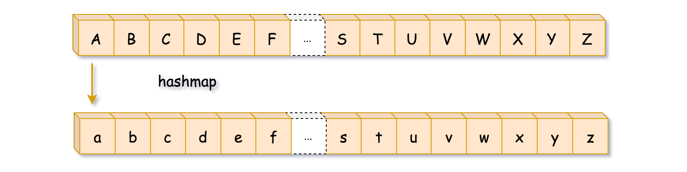

# 709 To Lower Case 

Given a string `s`, return *the string after replacing every uppercase letter with the same lowercase letter*.

**Example 1:**

```
Input: s = "Hello"
Output: "hello"
```

**Example 2:**

```
Input: s = "here"
Output: "here"
```

**Example 3:**

```
Input: s = "LOVELY"
Output: "lovely"
```

 

**Constraints:**

- `1 <= s.length <= 100`
- `s` consists of printable ASCII characters.


```java
class Solution {
    public String toLowerCase(String s) {
        char[] chars = s.toCharArray();
        for (int i = 0; i < chars.length; i++){
            if (chars[i] >= 'A' && chars[i] <= 'Z' ){
                chars[i] = (char) (chars[i] - 'A' + 'a');  
            }
        }

        return new String(chars);
        
    }
}
```

####  

#### HashMap

**Algorithm**

- Build hashmap uppercase letter --> lowercase letter.
- Parse the string. If the current character is an uppercase letter,
  *i.e.* it's in the hashmap, then replace it by the hashmap value.
  Otherwise, keep it unchanged.



**Implementation**

```java
class Solution {
    public String toLowerCase(String s) {
        Map<Character, Character> map = new HashMap<Character, Character>();
        String upperCase = "ABCDEFGHIJKLMNOPQRSTUVWXYZ"; 
        String lowerCase = "abcdefghijklmnopqrstuvwxyz";
        StringBuilder sb = new StringBuilder();
        for (int i = 0; i < 26; i++){
            map.put(upperCase.charAt(i), lowerCase.charAt(i));
        }

        for (int j = 0; j < s.length(); j++){
            if (map.containsKey(s.charAt(j))){
                sb.append(map.get(s.charAt(j)));
            }else{
                sb.append(s.charAt(j));
            }
        }
        

        return sb.toString();
    }
}

/*

hashmap
<Uppercase, lowercaese>

sb 


*/
```


**Complexity Analysis**

- Time complexity: O(N) to parse the input string.
- Space complexity: O(N) to keep the output.


