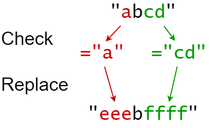
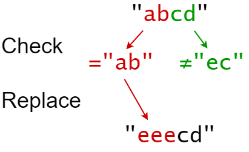

# 833 Find And Replace in String

You are given a **0-indexed** string `s` that you must perform `k` replacement operations on. The replacement operations are given as three **0-indexed** parallel arrays, `indices`, `sources`, and `targets`, all of length `k`.

To complete the `ith` replacement operation:

1. Check if the **substring** `sources[i]` occurs at index `indices[i]` in the **original string** `s`.
2. If it does not occur, **do nothing**.
3. Otherwise if it does occur, **replace** that substring with `targets[i]`.

For example, if `s = "abcd"`, `indices[i] = 0`, `sources[i] = "ab"`, and `targets[i] = "eee"`, then the result of this replacement will be `"eeecd"`.

All replacement operations must occur **simultaneously**, meaning the replacement operations should not affect the indexing of each other. The testcases will be generated such that the replacements will **not overlap**.

- For example, a testcase with `s = "abc"`, `indices = [0, 1]`, and `sources = ["ab","bc"]` will not be generated because the `"ab"` and `"bc"` replacements overlap.

Return *the **resulting string** after performing all replacement operations on* `s`.

A **substring** is a contiguous sequence of characters in a string.

 

**Example 1:**



```
Input: s = "abcd", indices = [0, 2], sources = ["a", "cd"], targets = ["eee", "ffff"]
Output: "eeebffff"
Explanation:
"a" occurs at index 0 in s, so we replace it with "eee".
"cd" occurs at index 2 in s, so we replace it with "ffff".
```

**Example 2:**



```
Input: s = "abcd", indices = [0, 2], sources = ["ab","ec"], targets = ["eee","ffff"]
Output: "eeecd"
Explanation:
"ab" occurs at index 0 in s, so we replace it with "eee".
"ec" does not occur at index 2 in s, so we do nothing.
```

 

**Constraints:**

- `1 <= s.length <= 1000`
- `k == indices.length == sources.length == targets.length`
- `1 <= k <= 100`
- `0 <= indexes[i] < s.length`
- `1 <= sources[i].length, targets[i].length <= 50`
- `s` consists of only lowercase English letters.
- `sources[i]` and `targets[i]` consist of only lowercase English letters.


```java
class Solution {
    public String findReplaceString(String s, int[] indices, String[] sources, String[] targets) {
        StringBuilder sb = new StringBuilder();
        Map<Integer, String> sourceMap = new HashMap<Integer, String>();
        Map<Integer, String> targetMap = new HashMap<Integer, String>();

        for (int i = 0; i < indices.length; i++){
            sourceMap.put(indices[i], sources[i]);
            targetMap.put(indices[i], targets[i]);
        }
        

        int i = 0;
        while(i < s.length()){
            if (sourceMap.containsKey(i) && s.startsWith(sourceMap.get(i), i)){
                sb.append(targetMap.get(i));
                i = i + sourceMap.get(i).length();
            }else{
                sb.append(s.charAt(i));
                i++;
            }
        }

        return sb.toString();
    }
}

/*
			
			s =		a b c d
						i 
		indices = [0, 2]
		            i    sourceMap = <0, "a">, <2, "b">
		            		 targetMap = <0, "eee">, <2, "ffff">
		source = "a", "b"
		targets = "eee", "ffff"
		
		
	
		
					
					


*/
```


`public boolean startsWith(String prefix, int strt_pos)`

`prefix`: The prefix is to be matched

`strt_pos`: Start position where to begin looking in the string.

**Return Type:** A boolean value that returns true if the character sequence represented by the argument is a prefix of the character sequence represented by this string; false otherwise.